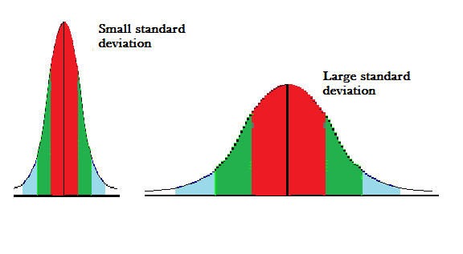
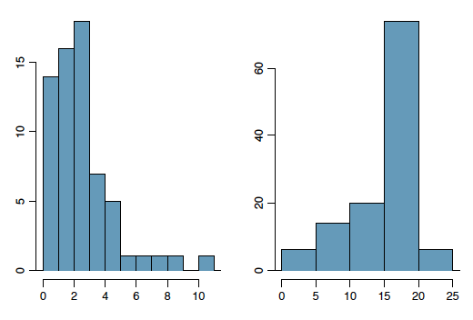
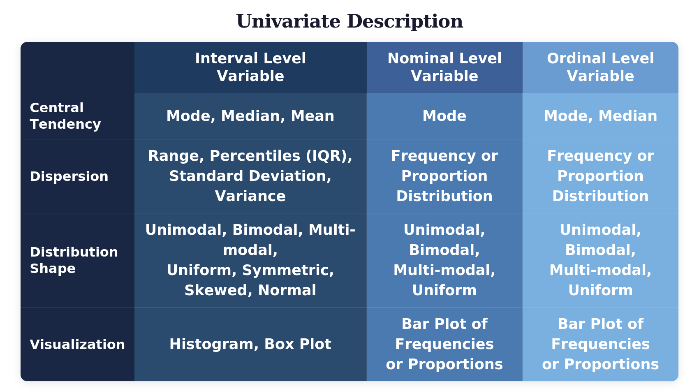

```{=html}
<style> /* Only show focus indicators when actually focused */
button:focus-visible, .btn:focus-visible {
  outline: 2px solid #6c757d;
  outline-offset: 1px;
}
/* Remove default focus styles that might conflict but preserve cursor */
button:focus, .btn:focus {
  outline: none;
}
/* Ensure proper cursor states for buttons */
button, .btn {
  cursor: pointer;
}
button:disabled, .btn:disabled {
  cursor: not-allowed;
}
/* Ensure keyboard users can see focus on code editors */
.ace_editor.ace_focus {
  border: 2px solid #6c757d !important;
}
/* Better contrast for exercise areas */
.tutorial-exercise {
  border: 1px solid #f0f0f0;
  border-radius: 4px;
  padding: 15px;
  margin: 20px 0;
}
/* Improved font and readability */
body {
  font-size: 16px;
  line-height: 1.5;
}
/* Accessible replacement for blue text */
.important-note {
  background-color: #e3f2fd;
  border-left: 4px solid #1976d2;
  padding: 12px;
  margin: 15px 0;
  font-weight: bold;
  border-radius: 4px;
}
/* Success/completion messages */
.success-note {
  background-color: #e8f5e8;
  border-left: 4px solid #4caf50;
  padding: 12px;
  margin: 15px 0;
  font-weight: bold;
  border-radius: 4px;
}
/* Package name styling */
.package-name {
  background-color: #e8f5e8;
  color: #2e7d32;
  padding: 2px 4px;
  border-radius: 3px;
  font-weight: bold;
}
.important-text { background-color: #e8f0ff; /* soft blue background (optional) */ color: #1565c0; /* blue text */ padding: 2px 4px; border-radius: 3px; font-weight: bold; }
/* Fix for Run Code button hover states - more specific targeting */
.tutorial-exercise-actions .btn {
  cursor: pointer !important;
}
.tutorial-exercise-actions .btn:hover {
  cursor: pointer !important;
}
.tutorial-exercise-actions .btn:disabled {
  cursor: not-allowed !important;
}
/* Override any conflicting learnr cursor rules */ [data-label] .btn,
.tutorial-exercise .btn,
button[data-label] {
  cursor: pointer !important;
}
/* Accessible table styling */
.table-container {
  overflow-x: auto;
  margin: 20px 0;
}
table {
  width: 100%;
  border-collapse: collapse;
  border: 1px solid #ddd;
}
th, td {
  border: 1px solid #ddd;
  padding: 12px;
  text-align: left;
}
th {
  background-color: #f5f5f5;
  font-weight: bold;
}
caption {
  padding: 10px;
  text-align: left;
  font-size: 1.1em;
  margin-bottom: 10px;
}
/* Focus styles for table cells */
th:focus, td:focus {
  outline: 2px solid #6c757d;
  outline-offset: 1px;
}
/* Skip navigation for keyboard users */
.skip-nav {
  position: absolute;
  top: -40px;
  left: 6px;
  background: #000;
  color: #fff;
  padding: 8px 16px;
  text-decoration: none;
  z-index: 1000;
  border-radius: 4px;
  font-weight: bold;
}
.skip-nav:focus {
  top: 6px;
  outline: 2px solid #fff;
}
/* Enhanced focus visibility for tutorial navigation */
.tutorial-panel-name:focus,
.tutorial-panel-name:focus-visible {
  outline: 1px solid #6c757d !important;
  outline-offset: 1px !important;
  background-color: rgba(108, 117, 125, 0.1) !important;
}
/* Better focus for exercise containers */
.tutorial-exercise:focus-within {
  outline: 1px solid #6c757d;
  outline-offset: 1px;
  background-color: rgba(108, 117, 125, 0.05);
}
/*New*/ /* Enhanced error message accessibility */
.alert-danger, .error, .tutorial-exercise-error {
  border-left: 4px solid #d32f2f;
  padding: 12px;
  margin: 10px 0;
  background-color: #ffebee;
  border-radius: 4px;
}
.alert-success, .tutorial-exercise-success {
  border-left: 4px solid #4caf50;
  padding: 12px;
  margin: 10px 0;
  background-color: #e8f5e8;
  border-radius: 4px;
}
/* Ensure error messages are visible and well-contrasted */
.tutorial-exercise-error {
  color: #d32f2f;
  font-weight: bold;
}
.tutorial-exercise-success {
  color: #2e7d32;
  font-weight: bold;
}
/* Focus styles for elements with error associations */
.ace_editor[aria-describedby]:focus {
  border-color: #d32f2f !important;
  box-shadow: 0 0 0 2px rgba(211, 47, 47, 0.2) !important;
}
</style>
```

```{=html}
<script>
document.addEventListener('DOMContentLoaded', function() {
  
  // Simple, reliable keyboard shortcut help
  document.addEventListener('keydown', function(e) {
    if (e.ctrlKey && e.shiftKey && e.key === '?') {
      e.preventDefault();
      alert(`R Tutorial Navigation Help:

KEYBOARD LIMITATIONS:
- Tab only moves between headings (not buttons or code boxes)
- Enter after Tab will jump to that heading
- Interactive exercises require mouse/trackpad clicks
- Code editing requires clicking in code boxes first

WHAT WORKS WITH KEYBOARD:
- Ctrl+F to search within the tutorial
- Tab to navigate between section headings
- Screen readers can access all text content

IMPORTANT: This tutorial platform has limited keyboard accessibility.
Interactive elements like "Run Code" and "Submit Answer" buttons
require mouse/trackpad interaction.`);
    }
  });
  
  // Screen Reader Instructions - Collapsible accessibility guidance
  function addScreenReaderInstructions() {
    const instructionsDiv = document.createElement('div');
    instructionsDiv.setAttribute('role', 'region');
    instructionsDiv.setAttribute('aria-label', 'Accessibility Instructions');
    instructionsDiv.innerHTML = `
      <div style="background: #f8f9fa; border: 1px solid #dee2e6; border-radius: 6px; margin: 15px 0;">
        <button id="accessibility-toggle" style="width: 100%; padding: 12px; background: none; border: none; text-align: left; cursor: pointer; font-weight: bold; color: #495057;" 
                aria-expanded="false" aria-controls="accessibility-content">
          ▶ Accessibility & Navigation Guide (Click to expand)
        </button>
        
        <div id="accessibility-content" style="display: none; padding: 0 15px 15px 15px;">
          <div style="margin-bottom: 15px;">
            <h4 style="color: #6c757d; font-size: 16px; margin-bottom: 8px;">Keyboard Navigation:</h4>
            <ul style="margin: 0; padding-left: 20px; line-height: 1.6; font-size: 14px;">
              <li><strong>Press Ctrl+Shift+?</strong> for detailed keyboard help dialog</li>
              <li>Tab moves between section headings only</li>
              <li>Enter after Tab jumps to that heading</li>
              <li>Ctrl+F to search within tutorial</li>
            </ul>
          </div>
          
          <div style="margin-bottom: 15px;">
            <h4 style="color: #6c757d; font-size: 16px; margin-bottom: 8px;">For Screen Reader Users:</h4>
            <ul style="margin: 0; padding-left: 20px; line-height: 1.6; font-size: 14px;">
              <li>All text content is accessible to screen readers</li>
              <li>Interactive code exercises require mouse interaction</li>
              <li>Success messages will be announced as they appear</li>
            </ul>
          </div>
          
          <div style="margin-bottom: 15px;">
            <h4 style="color: #6c757d; font-size: 16px; margin-bottom: 8px;">Platform Limitations:</h4>
            <ul style="margin: 0; padding-left: 20px; line-height: 1.6; font-size: 14px;">
              <li>Exercise buttons require mouse clicks</li>
              <li>Code editing needs mouse interaction</li>
              <li>Interactive elements cannot be reached via Tab</li>
            </ul>
          </div>
          
          <div style="margin-bottom: 15px;">
            <h4 style="color: #6c757d; font-size: 16px; margin-bottom: 8px;">Recommended Approach:</h4>
            <ul style="margin: 0; padding-left: 20px; line-height: 1.6; font-size: 14px;">
              <li>Read content using screen reader navigation</li>
              <li>Use heading navigation between sections</li>
              <li>Consider working with assistance for interactive exercises</li>
            </ul>
          </div>
          
          <p style="margin: 0; font-size: 13px; color: #6c757d; font-style: italic;">
            This platform has inherent accessibility limitations. We've enhanced what's possible while being transparent about constraints.
          </p>
        </div>
      </div>
    `;
    
    // Add click handler for toggle
    setTimeout(function() {
      const toggleBtn = document.getElementById('accessibility-toggle');
      const content = document.getElementById('accessibility-content');
      
      if (toggleBtn && content) {
        toggleBtn.addEventListener('click', function() {
          const isExpanded = content.style.display !== 'none';
          content.style.display = isExpanded ? 'none' : 'block';
          toggleBtn.setAttribute('aria-expanded', !isExpanded);
          toggleBtn.innerHTML = (isExpanded ? '▶' : '▼') + ' Accessibility & Navigation Guide (Click to ' + (isExpanded ? 'expand' : 'collapse') + ')';
        });
      }
    }, 500);
    
    // Try multiple ways to find the right insertion point
    let insertLocation = null;
    
    // Try 1: Look for the h2 with "Introduction" text 
    const headings = document.querySelectorAll('h2');
    for (let i = 0; i < headings.length; i++) {
      if (headings[i].textContent.includes('Introduction')) {
        insertLocation = headings[i];
        break;
      }
    }
    
    // Try 2: Just use the first h2 if Introduction not found
    if (!insertLocation) {
      insertLocation = document.querySelector('h2');
    }
    
    // Insert the accessibility guide immediately after the heading
    if (insertLocation) {
      insertLocation.parentNode.insertBefore(instructionsDiv, insertLocation.nextSibling);
      console.log('Accessibility guide added successfully');
    } else {
      console.log('Could not find insertion point for accessibility guide');
    }
  }
  
  // Enhance success messages with exercise context
  setInterval(function() {
    const successMessages = document.querySelectorAll('.alert-success:not([data-enhanced])');
    successMessages.forEach(function(msg) {
      msg.setAttribute('data-enhanced', 'true');
      msg.setAttribute('role', 'status');
      msg.setAttribute('aria-live', 'polite');
      
      // Add exercise context to success messages
      const exerciseContainer = msg.closest('.tutorial-exercise');
      if (exerciseContainer) {
        const originalText = msg.textContent;
        if (!originalText.includes('Exercise completed')) {
          msg.textContent = 'Exercise completed successfully: ' + originalText;
        }
      }
    });
  }, 2000);
  
  // Enhance error messages for screen readers
setInterval(function() {
  const errorMessages = document.querySelectorAll('.alert-danger:not([data-enhanced]), .tutorial-exercise-error:not([data-enhanced])');
  errorMessages.forEach(function(msg) {
    msg.setAttribute('data-enhanced', 'true');
    msg.setAttribute('role', 'alert');
    msg.setAttribute('aria-live', 'assertive');
  });
}, 2000);

  // Run the accessibility guide function
  setTimeout(addScreenReaderInstructions, 1000);
  
});
</script>
```

## Learning Objectives

In this tutorial, you will learn how to describe an [**interval level variable**]{.important-text} using summary statistics and plots. Specifically, we will cover:

* How to determine and describe the [**central tendency**]{.important-text} of an interval level variable
* How to use the `mean()` function
* How to summarize the [**dispersion**]{.important-text} of an interval variable
* How to create [**histograms**]{.important-text} and [**box plots**}{.important-text} using `ggplot()` in the package [ggplot2]{.package-name} with `geom_histogram()` and `geom_boxplot()`


```{r setup, include=FALSE}
library(learnr)
library(tidyverse)
library(knitr)
library(poliscidata)
library(gradethis)
tutorial_options(exercise.checker = gradethis::grade_learnr)
#tutorial_options(exercise.timelimit = 60)
knitr::opts_chunk$set(error = TRUE)
counties <- qpaTutorials::counties
counties$employ_pop_ratio_25_64 <- counties$employ_pop_ratio_25_64*100
counties$dem2p_percent <- counties$dem2p_vote_share*100
counties$wage_growth <- counties$wage_growth*100
```

## Univariate Description

You are now getting familiar with the tools we use to describe the variables in our data, the first step in data analysis. We have covered methods for summarizing nominal and ordinal variables using the mode and median (for ordinal data but not nominal data), frequency and proportion distribution tables, and bar plots.  In this lesson, we look at the tools available for describing [**interval variables**]{.important-text}.

 

**Practice: Concept of Interval-level Variables**
```{r concepts-quiz-interval-level, echo=FALSE}
question("Which of the following variables are interval level measures?",
  answer("The number of terrorist acts in the Middle East in a given year", correct = TRUE),
  answer("The poverty rate in a country", correct = TRUE),
  answer("The number of COVID-19 cases daily worldwide", correct = TRUE, message="Number of terrorist acts, poverty rate, and the number of COVID-19 cases are interval level because values are ranked and difference between them always mean the same thing. "),
  answer("Individual ideology measured on a scale of 1 to 7 from very liberal to very conservative", message = "Ideology is an ordinal variable with ranked differences that are not necessarily equal across the scale"),
  answer("The Polity democracy score measured on a scale from -10 (autocracy) to +10 (democracy)", message = "The Polity score is an ordinal variable because it is ranked but differences between values are not necessarily equal. Note, though, that analysts sometimes treat the differences as equal and therefore treat this variable as interval level. "),
  allow_retry = TRUE,
  try_again = "Have you selected all the interval level variables in this list?"
)
```

## Central Tendency

We can calculate the [**central tendency**]{important-text} of an interval variable using the mode, median, *and* mean.  As we will see, the mode is typically not very informative, and the mean is highly sensitive to outliers (extreme values), but all three measures are appropriate for this level of measurement.  

We've already discussed the median. The median is the value in the middle when we list all values in rank order for all cases. Thus it is the value at the 50th percentile: half the cases have values at or below the median, and half have values at or above the median. 


You are likely very familiar with the mean, or average, value. We compute the arithmetic [**mean**]{.important-text} by summing the values taken by the individual cases and divide by the total number of cases:

$$\bar{Y} = \frac{Y_1 + Y_2  + ... + Y_n}{n} = \frac{1}{n} \Sigma_{i=1}^n Y_i$$

Can you tell why the mean is not an appropriate measure of central tendency for nominal and ordinal variables?  We cannot add up categories like married, single, divorced, and widowed. Even if they are coded numerically, what would the mean of marital status *mean*? It is also an inappropriate measure of central tendency for an ordinal variable. Although we may be able to add up the values of an ordinal variable, because the differences between them are not equal, the mean is misleading. 
 
While the mean is the most commonly reported measure of tendency, it suffers when there are outliers in the data. Let's say we wanted to calculate the central tendency of the income of patrons at a bar in State College. Like good data analysts, we calculate the median and mean. They are likely to be similar most nights, but what happens if Elon Musk walks into the bar? The median income is not affected, but the mean would increase dramatically!  For this reason, we say that the median is robust to outliers, but the mean is not.

### The mode

We calculated the mode of nominal and ordinal variables by examining the frequency and proportion table. Let's create a frequency and proportion table for the interval level variable **wage_growth** in the **counties** data frame. The variable measures the rate of growth in wages for all employed persons in a county compared to four years ago, at the time of the last presidential election. Growth rate refers to the percentage rate of increase in the level wages over the four years. 


Don't forget to load the [dplyr]{.package-name} package with the `library()` function. Name your frequency variable `freq` and your proportion variable `prop`. Try not to look at the hints!

**Practice: Build a frequency & proportion table for wage_growth**
```{r Freq_Prop_table_for_wage_growth, exercise = TRUE, exercise.cap="Interactive exercise: Build a frequency and proportion table for wage_growth (freq and prop). Use the Run Code button to execute and see results. Five hints are available."}

```

```{r Freq_Prop_table_for_wage_growth-hint-1}
# Hint 1 of 5
Begin your pipeline by naming the counties data frame, and remember that each step should flow into 
the next using the pipe operator to keep things organized and readable as you build the frequency 
table.
```

```{r Freq_Prop_table_for_wage_growth-hint-2}
# Hint 2 of 5
Use group_by() to arrange the data by wage_growth so that all identical values are placed together   
before you compute any summary measures for them.
```

```{r Freq_Prop_table_for_wage_growth-hint-3}
# Hint 3 of 5
Within summarise(), create a new variable named freq that counts how many rows fall into each 
wage_growth group, using n() to calculate those counts.
```

```{r Freq_Prop_table_for_wage_growth-hint-4}
# Hint 4 of 5
After the frequency counts are established, apply mutate() to add a prop variable defined as freq 
divided by the total sum of freq across all groups.
```

```{r Freq_Prop_table_for_wage_growth-hint-5}
# Hint 5 of 5
Check that each operation -- group_by(), summarise(), and mutate() -- is linked with %>% so the 
code proceeds cleanly from the original data to the result.
```

```{r Freq_Prop_table_for_wage_growth-solution}
library(dplyr)
counties %>%
  group_by(wage_growth) %>%
  summarise(freq = n()) %>%
  mutate(prop = freq / sum(freq))
```

```{r Freq_Prop_table_for_wage_growth-check}
grade_code()
```

Can you see a problem?  What is the mode? The values of the variable are so precisely measured that no two counties have the exact same wage growth. This is often the case with interval level data. Even if two or three counties experienced the same growth in wages, the mode would not provide us with useful information about the typical county's wage growth. For this reason, we seldom calculate or present the mode of an interval variable.

### The median

Recall that we can calculate the median -- the value in the middle when we list all values in rank order for all cases -- using the `median()` function. 

Calculate the median  **wage_growth**:

**Practice: Compute the median of wage_growth **
```{r compute_median_wage_growth, exercise = TRUE,exercise.cap="Interactive exercise: Compute the median of wage_growth. Use na.rm = TRUE. Three hints are available."}

```

```{r compute_median_wage_growth-hint-1}
# Hint 1 of 3
Begin by using the median() function, which identifies the middle value of a variable once all 
observations have been sorted into rank order.
```

```{r compute_median_wage_growth-hint-2}
# Hint 2 of 3
Inside median(), reference the wage_growth variable from the counties data frame using the $ notation 
so the function knows which values to use.
```

```{r compute_median_wage_growth-hint-3}
# Hint 3 of 3
Because the instructions specify handling missing values, include the na.rm = TRUE argument within 
median() so any NA entries are ignored.
```

```{r compute_median_wage_growth-solution}
median(counties$wage_growth, na.rm = TRUE)
```

```{r compute_median_wage_growth-check}
grade_code()
```

The median value of wage growth is 4.70%, implying that after ranking all counties' wage growth rates, the value at the 50th percentile was 4.70%, or just under 5% wage growth.  Thus half the counties experienced wage growth at or less than 4.7%.

### The mean

We can calculate the mean using the `mean()` function. We pass the variable name for which we wish to calculate the statistic.  If there are any missing values in the data, we need to remember to use `na.rm = TRUE` so that these are omitted from the calculation. In fact, it is good practice to always include the `na.rm` argument when calling the `mean()` function.

Calculate the mean of **wage_growth**:

**Practice: Calculate the mean of wage_growth**
```{r compute_mean_wage_growth, exercise = TRUE,exercise.cap="Interactive exercise: Compute the mean of wage_growth Use na.rm = TRUE. Three hints are available."}

```

```{r compute_mean_wage_growth-hint-1}
# Hint 1 of 3
Begin by calling the mean() function, which computes the average value of a numeric variable by adding 
all observations and dividing by the number of cases.
```

```{r compute_mean_wage_growth-hint-2}
# Hint 2 of 3
Inside mean(), refer to the wage_growth variable from the counties data frame using the $ notation 
so R knows exactly which values to include in the calculation.
```

```{r compute_mean_wage_growth-hint-3}
# Hint 3 of 3
Because missing values must be excluded, include the na.rm = TRUE argument within mean() so that any 
NA entries are ignored when the average is computed.
```

```{r compute_mean_wage_growth-solution}
mean(counties$wage_growth, na.rm = TRUE)
```

```{r compute_mean_wage_growth-check}
grade_code()
```

The mean value of wage growth is very similar to the median: 4.33. 

### Your turn

Let’s look at another interval variable. We will examine the variable **dem2p_percent**, the percent of the two-party vote cast for the Democrat in a given county, in the data frame **counties**.

Calculate the median and mean of this variable.


**Practice: Compute the median and mean of dem2p_percent **
```{r compute_mean_median_dem2p_percent, exercise = TRUE, exercise.lines=4,exercise.cap="Interactive exercise: Compute the median and mean of dem2p_percent. Use na.rm = TRUE. Three hints are available."}

```

```{r compute_mean_median_dem2p_percent-hint-1}
# Hint 1 of 3
You will need to call both the median() and mean() functions, each on its own line, since the exercise 
asks you to compute two different statistics for the dem2p_percent variable in the counties data frame.
```

```{r compute_mean_median_dem2p_percent-hint-2}
# Hint 2 of 3
Inside each function, reference the dem2p_percent variable using the $ notation so that R knows to apply 
the calculation to the correct set of values drawn from the counties data frame.
```

```{r compute_mean_median_dem2p_percent-hint-3}
# Hint 3 of 3
Because missing values must be removed before either statistic is computed, include the na.rm = TRUE 
argument within both median() and mean() so any NA entries are excluded from the calculations.
```

```{r compute_mean_median_dem2p_percent-solution}
median(counties$dem2p_percent, na.rm = TRUE)
mean(counties$dem2p_percent, na.rm = TRUE)
```

```{r compute_mean_median_dem2p_percent-check}
grade_code()
```

The median percent of the vote cast by counties for Hillary Clinton was just under 30%. Half the counties cast 30% or fewer votes for Clinton and half 30% or more. The mean percent of the vote for Clinton was similar at 33.34%. The difference in these two statistics suggests that some counties cast large percentages of the vote for Clinton, pulling the mean up relative to the median.

## Dispersion

There are many statistics available to describe the dispersion of an interval level variable. We will consider:

1. [**Range**]{.important-text}
2. [**Percentiles**]{.important-text}, especially the [**interquartile range**]{.important-text}
3. [**Variance**]{.important-text} and [**standard deviation**]{.important-text}


## Range 

The [**range**]{.important-text} of values a variable takes is given by the smallest (minimum) value and the largest (maximum)  value. As such, it provides book ends on the spread of the values of the variable across cases. It is useful to report the range  of the data in the sample because the sample range may be different from the theoretical range of the data. It can also help us to identify the presence of outliers.


### The range(), min(), and max() functions

The R function `range()` directly calculates both the minimum and maximum values in the data. The function `min()`  calculates the minimum value of a variable, and the `max()` function calculates the maximum value. Each function is passed the name of the variable we are analyzing. If there are missing values, we need to include the `na.rm` argument and set it equal to `TRUE` so that R ignores those values when computing the statistic.

Let's calculate the range of the values of **wage_growth** to determine just how poor wage growth was in the least prosperous county and how strong wage growth was in the most prosperous county.  (Since wages can fall, wage growth need not be *growth* at all.) Enter code to calculate the range using the `range()` function and the `min()` and `max()` functions.

**Compute the range, min, and max of wage_growth**
```{r compute_range_min_max_wage_growth, exercise = TRUE,exercise.cap="Interactive exercise: Compute range(), min(), and max() for wage_growth. Use na.rm = TRUE. Three hints are available."}

```

```{r compute_range_min_max_wage_growth-hint-1}
# Hint 1 of 3
You will need to call three different functions -- range(), min(), and max()—each on its own line so 
that you clearly compute the overall spread, the lowest value, and the highest value of wage_growth.
```

```{r compute_range_min_max_wage_growth-hint-2}
# Hint 2 of 3
Inside each function, reference the wage_growth variable from the counties data frame using the $ 
notation so that R applies the calculations to the correct set of observations in the dataset.
```

```{r compute_range_min_max_wage_growth-hint-3}
# Hint 3 of 3
Because missing values must be excluded for accurate results, include the argument na.rm = TRUE in 
all three function calls so that any NA entries are ignored during the computations.
```


```{r compute_range_min_max_wage_growth-solution}
range(counties$wage_growth, na.rm = TRUE)
min(counties$wage_growth, na.rm = TRUE)
max(counties$wage_growth, na.rm = TRUE)
```

```{r compute_range_min_max_wage_growth-check}
grade_code()
```


Wow! We see that the least prosperous county saw a drop of nearly $70\%$ in wages over 4 years. The most prosperous county's wages grew by almost as much.

## Percentiles

A [**percentile**]{.important-text} is the value of the variable that has a certain percentage of the data points below it.   In other words, the nth percentile of a data set is the value that cuts off the first n percent of the data values when all of the values are sorted from least to greatest. We've already worked with the 50th percentile -- it's the median value! The 90th percentile of a variable is the value that cuts off the bottom $90\%$ of the data values from the top $10\%$ of data values.

Percentiles can be used to answer questions such as:

>What is the longest life expectancy in a county for counties in the bottom quarter of all counties in terms of life expectancy? 

To answer this question, we'd find the 25th percentile of life expectancy across counties. This is the age that separates the bottom $25\%$ of values from the top $75\%$.

> What are the percentages of working-age adults who are employed that cover the middle half of all counties? 

To answer this question, we would find the 75th percentile of the proportion of working-age adults who are employed and the 25th percentile. These are the two values that determine the upper and lower bounds for the middle $50\%$ of the data.


The 25th and 75th percentiles comprise what is known as the [inter-quartile range]{.important-text} or [**IQR**]{.important-text}. The IQR, splits the variable's values into four equal segments, or quartiles.  The advantage of the IQR as a measure of spread over the range is that any extreme values do not effect the IQR.


### The quantile() function

We can calculate percentiles with the `quantile()` function. By default, passing the variable name to the function will return the 0th, 25th, 50th,  75th, and 100th percentiles. (Be sure to include `na.rm = TRUE` if there are missing values for any case.) 

**Try it: Calculate the percentiles for wage_growth **
```{r calculate_percentile_wage_growth, exercise=TRUE,exercise.cap="Interactive exercise: List the default quantiles for wage_growth. Use the Run Code button to execute and see results."}
quantile(counties$wage_growth, na.rm = TRUE)
```

Note that the $0\%$ is the minimum and the $100\%$ is the maximum value, giving the range of the variable's values.

Let's focus on the interquartile range, the values at the 25th and 75th percentile, which demarcate the middle half of the data. The IQR tells us that the growth rate of wages for half the counties was between $2.5\%$ and $6.5\%$.  Notice how far removed from the middle the minimum and maximum values are. This suggests that there may be outliers in the data.

We can use the `quantile()` function to list additional percentiles by adding the `probs` argument inside the function. To list a specific set of percentiles set `probs = c(0.05, .1, .25, .5, .75, .9, .95)`.

**Try it: Calculate the additional percentiles for wage_growth**
```{r calculate_additional_percentile_wage_growth, exercise=TRUE,exercise.cap="Interactive exercise: List custom percentiles for wage_growth using probs = c(0.05, .1, .25, .5, .75, .9, .95)."}
quantile(counties$wage_growth, na.rm = TRUE, 
         probs = c(0.05, .1, .25, .5, .75, .9, .95))
```

The result shows that 90% of the cases fall between -2.60% and 9.92%. In other words, the bottom 5% of counties experienced declines in wage growth at or below 2.6% and the top 5% of counties experienced wage increases approaching 10% or higher.


### Your turn

Let's look at the 0, 25th, 50th, 75th, and 100th quantiles of the percent of working-age adults. This variable is named **employ_pop_ratio_25_64**, and it is located in the data frame **counties**.  Enter the code using the `quantile()` function:

**Practice: Calculate the percentiles for employ_pop_ratio_25_64 **
```{r calculate_percentile_employ_pop_ratio_25_64, exercise=TRUE,exercise.cap="Interactive exercise: List the default quantiles for employ_pop_ratio_25_64. Use the Run Code button to execute and see results. Three hints are available."}

```

```{r calculate_percentile_employ_pop_ratio_25_64-hint-1}
# Hint 1 of 3
Begin by using the quantile() function, which returns the default set of percentiles when you 
supply only the variable name without additional arguments such as probs for custom percentile values.
```


```{r calculate_percentile_employ_pop_ratio_25_64-hint-2}
# Hint 2 of 3
Inside quantile(), reference the employ_pop_ratio_25_64 variable from the counties data frame 
using the $ notation so that R applies the calculation to the correct values in this particular column.
```

```{r calculate_percentile_employ_pop_ratio_25_64-hint-3}
# Hint 3 of 3
Because missing values must be excluded before computing percentiles, be sure to include na.rm = TRUE 
inside the quantile() call so that any NA entries are properly ignored in the calculation.
```

```{r calculate_percentile_employ_pop_ratio_25_64-solution}
quantile(counties$employ_pop_ratio_25_64, na.rm = TRUE)
```

```{r calculate_percentile_employ_pop_ratio_25_64-check}
grade_code()
```

What is the range of the variable? $9.21\%$ to $668.07\%$. How can this be? Whenever you see percents that are greater than 100 it is possible that there is a data error. Here, the problem is that the numerator, employment, is calculated based on the number of people working in a county, and the denominator, population aged 25-54, is calculated based on the population in that county. Percentages greater than 100 will occur if many workers commute to a different county than that in which they live. This happens in big cities like New York City and Los Angeles.

The IQR is $51.23\%$ to $83.53\%$. This tells us that in half of the counties between about $51\%$ and $84\%$ of the population between the ages 25 and 54 are working.

We can also extract the median from the output. The middle value in the data is $66.61\%$. Half of the counties have that percent or less of the population between ages 25 and 54 working.

## Standard deviation (and variance)

The [**standard deviation**]{.important-text} tells us the average spread of values of a variable around (difference from) the mean value of the variable.  The [**variance**]</span> is the squared standard deviation.
 
The formula for the standard deviation, denoted byt $s$, is
 
$$s=\sqrt{\frac{\Sigma_{i=1}^n({Y_i-\bar{Y}})^2}{n-1}}$$
 
 Let's pick this apart by considering an example where the variable of interest is the height of recent presidents. Below is a table listing the heights (in centimeters) of the 10 presidents from Johnson through Trump's first term. In addition, the table presents the deviations in column three and deviations squared in column four that are given in the formula numerator above.  The last row of the table sums the values in the column. Thus we have the building blocks to calculate the standard deviation.
 

<table id="pres-stats-table" aria-labelledby="pres-stats-caption"> <caption id="pres-stats-caption">  </caption> <thead> <tr> <th scope="col">President</th> <th scope="col">\(Y_i\)</th> <th scope="col">Deviation \((Y_i - \bar{Y})\)</th> <th scope="col">Deviation\(^2\) \((Y_i - \bar{Y})^2\)</th> </tr> </thead> <tbody> <tr><th scope="row">Trump</th><td>188</td><td>188 − 184.7 = 3.3</td><td>10.89</td></tr> <tr><th scope="row">Obama</th><td>185</td><td>185 − 184.7 = 0.3</td><td>0.09</td></tr> <tr><th scope="row">Bush II</th><td>182</td><td>182 − 184.7 = −2.7</td><td>7.29</td></tr> <tr><th scope="row">Clinton</th><td>188</td><td>188 − 184.7 = 3.3</td><td>10.89</td></tr> <tr><th scope="row">Bush I</th><td>188</td><td>188 − 184.7 = 3.3</td><td>10.89</td></tr> <tr><th scope="row">Reagan</th><td>185</td><td>185 − 184.7 = 0.3</td><td>0.09</td></tr> <tr><th scope="row">Carter</th><td>177</td><td>177 − 184.7 = −7.7</td><td>59.29</td></tr> <tr><th scope="row">Ford</th><td>183</td><td>183 − 184.7 = −1.7</td><td>2.89</td></tr> <tr><th scope="row">Nixon</th><td>180</td><td>180 − 184.7 = −4.7</td><td>22.09</td></tr> <tr><th scope="row">Johnson</th><td>191</td><td>191 − 184.7 = 6.3</td><td>36.69</td></tr> </tbody> <tfoot> <tr> <th scope="row">Summary</th> <td>\(\bar{Y}=\frac{1}{n}\sum_{i=1}^n Y_i=184.7\)</td> <td>\(\sum_{i=1}^n (Y_i-\bar{Y})=0\)</td> <td>\(\sum_{i=1}^n (Y_i-\bar{Y})^2=164.1\)</td> </tr> </tfoot> </table>
 
 
Steps to calculate the standard deviation:

1. Calculate the deviation --- how far above/below the mean: $(Y_i-\bar{Y})$ --- for each observation (column three). Observations below the mean have negative deviations and above the mean have positive deviations.  If the variable is not very dispersed, the deviations will be close to the mean. Bigger deviations result in more dispersion.
2. By definition the average deviation will always be zero: deviations above the mean will offset the deviations below the mean. To avoid this problem, we square them (in column four).
3. Now we can calculate the mean of the squared deviations by summing these and dividing by not $n=10$, but $n-1=9$ (we'll see why later). The result is $164.1$.
4. If we stop here, we have the variance. Taking the square root gets us back to our original units and is called the standard deviation:

$$s=\sqrt{\frac{\Sigma_{i=1}^n({Y_i-\bar{Y}})^2}{n-1}}= \sqrt{\frac{164.1}{9}}=4.27$$

Note that $s$ is always positive.

Given the standard deviation of a variable, it may be hard to tell whether it is highly dispersed or not in any absolute sense, but it is easy to see that a sample with a standard deviation (for some variable) of 2 has less dispersion than one with 10.  The empirical rule can help us interpret the standard deviation.


## The Empirical Rule


The [**Empirical Rule**]{.important-text} tells us that if the distribution of observations is approximately bell-shaped (it is normal and symmetric, more later) then:

1. Approximately $68\%$ of observations fall between $\bar{Y}-s$ and $\bar{Y}+s$: over half of all of the observations will fall within one standard deviation of the mean.
2. About $95\%$ of observations fall within two standard deviations of the mean, between $\bar{Y}-2s$ and $\bar{Y}+2s$
3. Nearly all (over $99\%$) of the observation in the data in a normal distribution will fall within three standard deviations of the mean, between $\bar{Y}-3s$ and $\bar{Y}+3s$.


Below is a picture of two distributions. The red portion is shaded to denote $\bar{Y}-s$ and $\bar{Y}+s$; the green and red parts together illustrate $\bar{Y}-2s$ and $\bar{Y}+2s$; and the blue part extends to $\bar{Y}-3s$ and $\bar{Y}+3s$. The distribution on the left illustrates a smaller standard deviation while that on the right has a larger standard deviation. As you can see, the observations are clustered closer to the mean in the left-hand plot and further from the mean in the right-hand plot.


{width="70%" fig.alt="Two bell curves shown side-by-side on a white background. The left curve, labeled ‘Small standard deviation,’ is tall and narrow with a central vertical mean line; red center, green mid-bands, and light-blue tails suggest $\pm 1 \sigma / \pm 2 \sigma$ regions. The right curve, labeled ‘Large standard deviation,’ is shorter and wider with the same mean line and color bands spread farther from the center."}

### The sd() function

To calculate the standard deviation, $s$, of a variable we use the `sd()` function, again including `na.rm = TRUE` to remove any observations with missing values for the variable.

**Try it: calculate SD (standard deviation) for wage_growth**
```{r calculate_sd, exercise=TRUE, exercise.cap="Interactive exercise:  Calculate standard deviation for wage_growth, Use the Run Code button to execute and see results."}
sd(counties$wage_growth, na.rm = TRUE)
```


If the distribution of wage growth were approximately normal, we could use the Empirical Rule to understand how most counties compare to the average. With a mean of 4.33 and a standard deviation of 4.68, we calculate the ranges by adding and subtracting one, two, and three standard deviations from the mean:

+ **One standard deviation from the mean (about 68% of counties):**
  +  Mean − SD: 4.33 − 4.68 = **−0.35**
  +  Mean + SD: 4.33 + 4.68 = **9.01**
  + So roughly two-thirds of counties have wage growth between **−0.35% and 9.01%**.

* **Two standard deviations from the mean (about 95% of counties):**
  + Mean − 2×SD: 4.33 − 9.36 = **−5.03**
  + Mean + 2×SD: 4.33 + 9.36 = **13.69**
  + So almost all counties fall between **−5.03% and 13.69%**.

* **Three standard deviations from the mean (over 99% of counties):**
  + Mean − 3×SD: 4.33 − 14.04 = **−9.71**
  + Mean + 3×SD: 4.33 + 14.04 = **18.37**
  + Under a roughly normal distribution, nearly every county would lie between **−9.71% and 18.37%**.

However, the actual minimum and maximum values in the data are −69.39% and 62.56%, which are far outside these ranges. That suggests there may be outliers --- counties with very unusual wage-growth patterns or possible data errors that deserve closer attention.


## The shape of the distribution

Assessing the [**shape of the distribution**]{.important-text} of an interval variable is most easily done after visualizing the distribution in a plot. Let's do that and then discuss how we might describe the shape of the distribution.

. 

## Visualizing the distribution of an interval variable


For the same reason a frequency table is not a useful way to describe an interval variable, a bar plot is inappropriate for visualizing an interval variable. So what do we do with interval level variables? We can generalize the bar chart to illustrate the shape of the distribution of an interval level variable using a [**histogram**]{.important-text}. A histogram is a very common method for presenting the distribution of interval level data. Histograms collect observed values and put them in *bins* that cover *ranges* of values. Once in bins, the height of the bar is given by the number of values in that bin. We can also present a histogram using proportions. In this case, the height of the bar is calculated as the proportion of observations in the bin divided by the width of the bin (number of values covered by the bin). The total area in the bars sums to 1.0.  We can control the number of bins -- or their width -- or let R pick.

Histograms illustrate the central tendency of the variable and its dispersion, as well as the shape of the distribution.


###  The histogram

Generating a histogram with `ggplot()` requires a simple change to the basic code for a bar plot.  Because we want a different visual, or geometric, representation, we replace `geom_bar()` with `geom_histogram()`. That's it! (Note that we do not need to enclose **wage_growth** inside `factor()` because the variable can take on any value in its range.) 

**Try it: Generate the histogram for wage_growth in counties data**
```{r generate_histogram_wage_growth, exercise=TRUE, exercise.cap="Interactive exercise: Generate a histogram of wage_growth."}
ggplot(data = counties,  mapping = aes(x = wage_growth)) +
         geom_histogram() +
         labs(title = "Wage Growth in US Counties in 2016", 
              x = NULL, 
              y = "Frequency", 
              caption = "Linn, Nagler, and Zilinsky")
```

Ignore the warning for now (the warning is telling us there are some missing values that could not be included in the plot) and notice that it's difficult to determine the range of values covered by a bin. Let’s add white vertical borders demarcating the bins by adding a `color = "white"` argument to `geom_histogram()`.


**Try it: Generate the histogram for wage_growth with white bin borders**
```{r generate_histogram_wage_growth_white, exercise=TRUE,exercise.cap="Interactive exercise: Generate a histogram of wage_growth with white bin borders."}
ggplot(data = counties,  mapping = aes(x = wage_growth)) +
         geom_histogram(color = "white") +
         labs(title = "Wage Growth in US Counties in 2016", 
              x = NULL, 
              y = "Frequency", 
              caption = "Linn, Nagler, and Zilinsky")
```


Notice that there is a warning message associated with the plot. "Pick better value with `binwidth`." `ggplot()` will choose 30 and give us a warning that we might wish to consider alternatives. To do so, we have two options. We can set the number of bins by adding the `bins` argument to `geom_histogram()` and setting it equal to some number. Try changing the number of bins in our plot to 50.


**Practice: Generate the histogram for wage_growth with different bins number**
```{r generate_histogram_wage_growth_custom_bin, exercise=TRUE,exercise.cap="Interactive exercise: Generate a histogram of wage_growth with 50 bins and white borders. Two hints are available."}
ggplot(data = counties,  mapping = aes(x = wage_growth)) +
         geom_histogram(color = "white", XXXX = XXXX) +
         labs(title = "Wage Growth in US Counties in 2016", 
              x = NULL, 
              y = "Frequency", 
              caption = "Linn, Nagler, and Zilinsky")
```


```{r generate_histogram_wage_growth_custom_bin-hint-1}
# Hint 1 of 2
Inside geom_histogram(), you need to specify the number of bins you want 
ggplot() to use. Add the bins argument and set it equal to 50, exactly as 
the prompt requests for this customized histogram.
```

```{r generate_histogram_wage_growth_custom_bin-hint-2}
# Hint 2 of 2
Remember that the bins argument must appear inside geom_histogram() along 
with the color setting. Keep color = "white" as it is, and then include a 
comma followed by bins = 50 so both options are applied to the histogram.
```


```{r generate_histogram_wage_growth_custom_bin-solution}
ggplot(data = counties,  mapping = aes(x = wage_growth)) +
         geom_histogram(color = "white", bins = 50) +
         labs(title = "Wage Growth in US Counties in 2016", 
              x = NULL, 
              y = "Frequency", 
              caption = "Linn, Nagler, and Zilinsky")
```

```{r generate_histogram_wage_growth_custom_bin-check}
grade_code()
```

Changing the number of bins changes how the data are grouped, which can noticeably alter the appearance of the histogram. With too few bins, the histogram can hide important features of the distribution because each bar covers a wide range of values. With too many bins, the plot can look noisy, making it difficult to see the overall pattern. Adjusting the number of bins helps you balance detail and readability so the histogram shows the meaningful structure in the data without overwhelming the viewer.


Alternatively, you can control the width of the bin. This sets the range of values covered by a bin. If a variable takes values that range from, for example, 0 to 100, we might want each bin to cover 10 units. We could specify `bins = 10` (100/10=10) or set `bindwidth = 10`. Let's set the binwidth for wage growth to 0.8 or eight-tenths of a percentage point.

**Practice: Generate the histogram for wage_growth with different bins width**
```{r generate_histogram_wage_growth_custom_bin-witdh, exercise=TRUE,exercise.cap="Interactive exercise: Generate a histogram of wage_growth with 0.8 binswidth and white borders."}
ggplot(data = counties,  mapping = aes(x = wage_growth)) +
         geom_histogram(color = "white", binwidth = .8) +
         labs(title = "Wage Growth in US Counties in 2016", 
              x = NULL, 
              y = "Frequency", 
              caption = "Linn, Nagler, and Zilinsky")
```

Try experimenting with the binwidth in the plot to make sure you understand what this argument is doing.

Let's interpret the plot. What can we say about the shape of the distribution?

1. The distribution looks tightly clustered. The x-axis has such a broad range because there is a county with very large declines in wages (remember the range of the values from above) and a county with very large wage growth (although you cannot see these in the plot). If we ignored these two counties, the distribution would look much less tight as, in effect, we would zoom in on the remaining counties.
2. The distribution looks bell-shaped or similar to a normal distribution.
3. The distribution is fairly [**symmetric**]{.important-text}. This simply means the pattern to the left of the mean looks like that to the right. 


### Skew

Not all variables will have symmetric distributions. Instead, they may be [**skewed**]{.important-text}. Histograms are said to be skewed to the side of the long tail. The two histograms below are clearly not symmetric. The image on the left is skewed to the right. The image on the right is skewed to the left.

{width="70%" fig.alt="Two histograms shown side-by-side. Left panel: positively skewed (right-skew), with many low values near 0–3 and a long sparse tail extending right toward ~10. Right panel: negatively skewed (left-skew), with many high values near 15–20 and a long sparse tail extending left toward 0. Both use equal-width bins with semi-transparent blue bars."}


### Adding the median and mean to a histogram

Often it is useful to add a vertical line to a histogram to represent the median and/or the mean value. To do so, we add another layer to our plot.  We want to add a vertical line, so we will use the `geom_vline()` function. We need to tell R where to place the line and specifically where it crosses the x-axis. We do so by specifying an aesthetic inside `geom_vline()` and setting the `xintercept` argument equal to the value we wish. Let's add the median to our plot. We'll make the `linetype` `"dashed"` and `color` it `"red"` to make it stand out. I've also set `bins = 60` in `geom_histogram()`. This means that the width of the bins will be the maximum value of wage growth minus the minimum value and this quantity will be divided by 60.

**Explore: Add and label the median line**
```{r explore_label_median_line, exercise=TRUE,exercise.cap="Interactive exercise: Add a dashed red median line and label it on the histogram."}
ggplot(data = counties,  mapping = aes(x = wage_growth)) +
         geom_histogram(color = "white", bins = 60) +
         geom_vline(aes(xintercept = median(wage_growth, na.rm = TRUE)), color = "red", linetype = "dashed") +
         labs(title = "Wage Growth in US Counties in 2016", 
              x = NULL, 
              y = "Frequency", 
              caption = "Linn, Nagler, and Zilinsky")
```

It would be helpful to label the line. To do so we add another layer to the plot with the `annotate()` function. This line of code is a little more complicated. 


1. The first argument is the name of the geom to use for annotation and is set to `"text".`
2. The `x` and `y` arguments give the exact positions—along the x-axis and y-axis—where the center of your text label will appear. To choose reasonable values, first look at the plot and find the approximate location of the vertical line you are labeling; your `x` value should be close to that location so the text sits near the line. The `y` value should be high enough that the label sits above the tallest bars in the histogram, but not so high that it appears outside the visible plotting area. In practice, you often need to try out several combinations of `x` and `y` values until the label is clearly visible and does not overlap with the bars.
3. The `label` argument provides the label for the annotation. Here we paste together the word `"Median="` with the R expression to calculate the median. Note that you have to give the data frame name when using the `median()` function, and you need to include `na.rm = TRUE` if any observations have missing values.
4. It is often useful to use the `round()` function to limit the number of decimals reported in the plot. The function is passed the quantity to round followed by a comma and the number of digits to round to.

It's easy to have mismatched parentheses, so be careful when coding.

Try plotting the mean rather than the median and playing around with the x and y locations in the code below until you find coordinates that look good by replacing XXXX. Notice that I've changed the `linetype` to `"dotted"`.


**Practice: plot the vertical line and add additional text**
```{r plot_vertical_and_text, exercise=TRUE,exercise.cap="Interactive exercise: Add a dotted red median line and text on the histogram. Two hints are available."}
ggplot(data = counties,  mapping = aes(x = wage_growth)) +
         geom_histogram(color = "white", bins = 60) +
         geom_vline(aes(xintercept = XXXX(XXXX)), color = "red", linetype = "dotted") +
         annotate("text", x = XXXX, y = XXXX, 
                  label = paste0("Mean = ", 
                                 round(mean(counties$wage_growth, na.rm = TRUE), 3))) +
         labs(title = "Wage Growth in US Counties in 2016", 
              x = NULL, 
              y = "Frequency", 
              caption = "Linn, Nagler, and Zilinsky")
```


```{r plot_vertical_and_text-hint-1}
# Hint 1 of 2
Inside geom_vline(), use the mean() function with na.rm = TRUE so the dotted 
vertical line is positioned at the correct average wage_growth value based on 
all non-missing observations in the dataset.
```

```{r plot_vertical_and_text-hint-2}
# Hint 2 of 2
For the annotate() layer, choose x and y coordinates that place the text close 
to the dotted line at a readable height above the bars; you may need to try 
several values to find a clear location that avoids overlapping the histogram.
```

```{r plot_vertical_and_text-solution}
ggplot(data = counties,  mapping = aes(x = wage_growth)) +
         geom_histogram(color = "white", bins = 60) +
         geom_vline(aes(xintercept = mean(wage_growth, na.rm = TRUE)), color = "red", linetype = "dotted") +
         annotate("text", x = 25, y = 900, 
                  label = paste0("Mean = ", 
                                 round(mean(counties$wage_growth, na.rm = TRUE), 3))) +
         labs(title = "Wage Growth in US Counties in 2016", 
              x = NULL, 
              y = "Frequency", 
              caption = "Linn, Nagler, and Zilinsky")
```


### The box plot


A [**box plot**]{.important-text} is an alternative way to visualize the distributions of an interval level variable. It is particularly useful when we want to compare the distribution of one variable broken down by categories of another variable. A box plot visualizes the median, the IQR, and outlying observations together in a single object.


We generate a box plot by changing the basic histogram plot in two ways. First, we map the variable we want to plot to the y-axis rather than the x-axis. Use `x = ""` for a cleaner plot. Second, we use `geom_boxplot()` rather than `geom_histogram()`.

Let's plot the percent of working-age adults. Recall this variable is named **employ_pop_ratio_25_64**. 

**Try it: plot the distribution of the employment to population ratio using boxplot**
```{r boxplot_employment_ratio, exercise=TRUE,exercise.cap="Interactive exercise: Plot a box plot of employ_pop_ratio_25_64."}
ggplot(data = counties, aes(x = "", y = employ_pop_ratio_25_64)) +
  geom_boxplot() +
  labs(title = "Distribution of the Employment to Population Ratio \n Adults Aged 25-64", 
       subtitle = "US Counties, 2016",
       x = NULL, 
       y = NULL, 
       caption = "Source: Linn, Nagler, and Zilinsky") 
```

What does this plot tell us? 

1. The heavy solid horizontal line indicates the median, which is $66.8\%$.
2. The boxed area tells us the values in the middle $50\%$ of the data -- that ranging from the 25th to the 75th percentile of the distribution. The height of the box (the value of the 3rd quartile minus the value of the 1st quartile) is the interquartile range  or IQR. It provides a measure of the spread of the middle 50% of values. Here this range of values is very small: in half the counties between about half and about $90\%$ of their working age population are employed. Longer boxes would indicate more variability. 
3. The “whisker” portions of these plots extend out from the bottoms and tops of the boxes and represent points less than the 25th percentile and greater than the 75th percentiles, respectively. They’re set to extend out no more than 1.5 × IQR units away from either end of the boxes. If there are no observations that far out, the whiskers end at the nearest extreme data point. Longer whiskers indicate more variability. 
4. Observations outside that range -- beyond 1.5 × IQR from the box -- are indicated by circles. The circles represent outliers or unusual values. Here we see that several counties have more than $100\%$ of adults age 25-54 who are employed. (These counties must be "importing" workers from other counties.)


### Your turn

Plot the variable **dem2p_percent** in the data frame **counties** and describe the distribution. Recall this variable is the percent of the-two party vote cast for the Democrat in a given county.

Start by producing a histogram with blue outlines. Then add a vertical line for the median value and label it in red. Use a dotted red line to distinguish it clearly from the bars, and adjust the x and y coordinates in your annotation so the label appears close to the line and above the bars.

**Practice: Histogram Plot for dem2p_percent (blue outlines, optional mean/median lines)**
```{r histogram_dem2p_percent, exercise=TRUE,exercise.cap="Interactive exercise: Plot a histogram of dem2p_percent with blue outlines; optionally add red mean/median lines and labels. Four hints are available."}

```

```{r histogram_dem2p_percent-hint-1}
# Hint 1 of 4
Begin by calling ggplot(), identify the counties data frame, and map 
dem2p_percent to the x-axis inside aes() so the histogram displays the 
distribution of the Democratic vote share. Be sure to end the line with a +
to add the geom layer on the following line.
```

```{r histogram_dem2p_percent-hint-2}
# Hint 2 of 4
Add geom_histogram() with color = "blue" to outline the bars, and end the 
line with a + so you can add the vertical median line and annotation in the 
layers that follow.
```

```{r histogram_dem2p_percent-hint-3}
# Hint 3 of 4
Add a vertical reference line using geom_vline() and set xintercept equal 
to median(dem2p_percent, na.rm = TRUE); keep color = "red" outside aes() 
and set linetype = "dotted" so the line stands out clearly.
```

```{r histogram_dem2p_percent-hint-4}
# Hint 4 of 4
Use annotate("text", ...) to label the median line; choose x and y values 
that place the text near the dotted line and above the bars, and use 
paste0() with round(median(...), digits) to display a clean rounded value 
in the label.
```


```{r histogram_dem2p_percent-solution}
ggplot(data = counties,  mapping = aes(x = dem2p_percent)) +
         geom_histogram(color = "blue") +
         geom_vline(aes(xintercept = median(dem2p_percent, na.rm = TRUE)), color = "red", linetype = "dotted") +
         annotate("text", x = 20, y = 350, 
                  label = paste0("Median = ", 
                                 round(median(counties$dem2p_percent, na.rm=TRUE), 1))) +

         labs(title = "Democratic Vote Share",
              subtitle = "US Counties in 2016", 
              x = NULL, 
              y = "Frequency", 
              caption = "Linn, Nagler, and Zilinsky")
```

The distribution is clearly **right-skewed**. A large concentration of counties have Democratic vote shares well below the median, while fewer counties gave high vote shares to the Democratic candidate. The long right tail shows that only a small subset of counties cast very large percentages of their votes for Clinton.

## The Takeaways

Describing interval variables is more involved than describing either nominal or ordinal level variables. We have more tools at our disposal because the level of granularity of the data is finer.  To summarize what we've learned:

1. There are 3 types of descriptive information to help you convey the main features of a single variable: [**central tendency**]{.important-text}, [**dispersion**]{.important-text}, and the [**shape of the distribution**]{.important-text}. Each piece of information complements the others.
2. The appropriate tools for description depend on the level of measurement of the variable you wish to describe. The information here describes what is appropriate for interval variables.

    a. The [**mode**]{.important-text} is not typically a useful measure of [**central tendency**]{.important-text} for an interval variable. Instead, we use the [**median**]{.important-text} and [**mean**]{.important-text}.  The median value marks the middle value or the value at the 50th percentile  of the distribution when all observations' values are rank-ordered. The mean gives the arithmetic average. The median is not influenced by outliers, while the mean can be pulled from the center of the distribution in the presence of outliers. For this reason, the median is said to be a robust statistic. The median and mean will be similar when the distribution is symmetric.
    b. We summarize the [**dispersion**]{.important-text} in the data with the [**range**]{.important-text}, [**percentiles**]{.important-text} (especially the [**interquartile range**]{.important-text}, which bookends the middle half of the data), the [**variance**]{.important-text}, and the [**standard deviation**]{.important-text}. 
    c. A [**histogram**]{.important-text} illustrates the dispersion of interval level data and the shape of the distribution. In assessing the shape of the distribution, we are interested in whether it is symmetric or skewed, as well as whether it is unimodal, bimodal, multi-modal, or uniform and its approximation to a normal distribution.  [Box plots]{.important-text} represent an alternative data visualization for the distribution of interval level data.
    

Which of these pieces of information should you present when conducting descriptive analysis on an interval variable? Once again, the choice depends on the main feature or features of the data and what you wish to emphasize. If the variable plays a central role in your research question, more information is better. Often a plot, perhaps including the median/mean, accompanied by some text is all that is required.

## Pulling what we've learned together.

The figure below brings together the tools you’ve learned for describing [**nominal**]{.important-text}, [**ordinal**]{.important-text}, and [**interval variables**]{.important-text}. Although all three levels of measurement rely on the same broad ideas --- [**central tendency**]{.important-text}, [**dispersion**]{.important-text}, and the [**shape of the distribution**]{.important-text} --- the specific statistics and visualizations that are appropriate differ across levels. Nominal variables are summarized primarily with modes and frequency distributions; ordinal variables add the median as a meaningful summary; and interval variables allow the richest set of tools, including the mean, median, standard deviation, percentiles, histograms, and box plots. The choices you make in practice should depend on the role a variable plays in your research question and what aspects of the distribution you wish to emphasize. The chart provides a compact reference that summarizes these options and can help guide you as you decide how best to describe your data in applied work.

```{r univariate-description-figure, echo=FALSE,fig.align = "center", out.width = "95%",  fig.alt = "Infographic titled 'Univariate Description'. Left sidebar lists Central Tendency, Dispersion, Distribution Shape, and Visualization. Three main panels show stacked blue boxes for interval, nominal, and ordinal level variables with their recommended measures of central tendency, dispersion, distribution shape, and visualization."}

```


## Test your Knowledge

**Practice: Identify false statements about measurement levels**
```{r identify_measurment_levels, echo=FALSE}
question("Which of the following statements are **NOT** true",
  answer("We can describe the central tendency of a nominal variable using the median", correct=TRUE, message = "Only the mode can be used to describe the central tendency of a nominal variable. "),
  answer("The mean and median can be used to describe an ordinal variable", correct=TRUE, message="The mean is a misleading measure of central tendency for an ordinal variable because the differences between values are not equal. "),
  answer("A bar plot illustrates the dispersion in an ordinal variable", message="A bar plot is appropriate to visualizing the distribution of an ordinal variable. "),
  allow_retry = TRUE,
  try_again = "Hint: More than one statement is false"
)
```


**Practice: Identify Core distribution concepts**
```{r identify_distribution_concepts, echo=FALSE}
question("Which of the following statements are true",
  answer("The mean is a robust summary statistic", message = "The mean is sensitive to outliers and is thus not robust"),
  answer("A distribution whose shape is skewed right has a long tail on the right", correct = TRUE, message="The direction in which the tail of the distribution extends out is the direction a variable is skewed. "),
  answer("The standard deviation can be interpreted as the average difference of observations from the mean", correct = TRUE, message="The Emprirical Rule tells us that 68% of the data fall within plus or minus one standard deviation of the mean, which is more than half. "),
  answer("The mode should be reported as a measure of central tendency regardless of a variable's level of measurement", message = "The mode is generally not a useful summary statistic for interval level variables"),
  allow_retry = TRUE,
  try_again = "Hint: More than one statement is true."
)
```

Consider the following image and answer the questions:

```{r, echo=FALSE}
world %>%
  filter(!is.na(spendeduc)) %>%
ggplot(aes(x = spendeduc)) +
  geom_histogram(color = "white", bins = 20) +
  labs(title = "Public Expenditure on Education Around the World",
       caption = "Country Data from the United Nations",
       x = "Percent of GDP",
       y = "Frequency") +
          annotate("text", x = 10, y = 18, 
                  label = paste0("Standard Deviation = ", 
                                 round(sd(world$spendeduc, na.rm = TRUE), 2))) 
```

**Practice: Interpret the education-spending histogram**
```{r plot_interpretation, echo=FALSE}
question("Which of the following statements are true",
  answer("The distribution is unimodal", correct = TRUE, message="The distribution is unimodal because there is a single peak in the distribution of the data. "),
  answer("The mean is likely a better measure of central tendency than the median", message = "The outliers are likely to pull the mean up but the median is a robust measure of central tendency"),
  answer("About half of the observations are within 1.92 percentage points of the mean", correct = TRUE, message="The standard deviation tells us the distance of a majority of observations in the data from the mean. "),
  allow_retry = TRUE,
  try_again = "Hint: More than one statement is true."
)
```