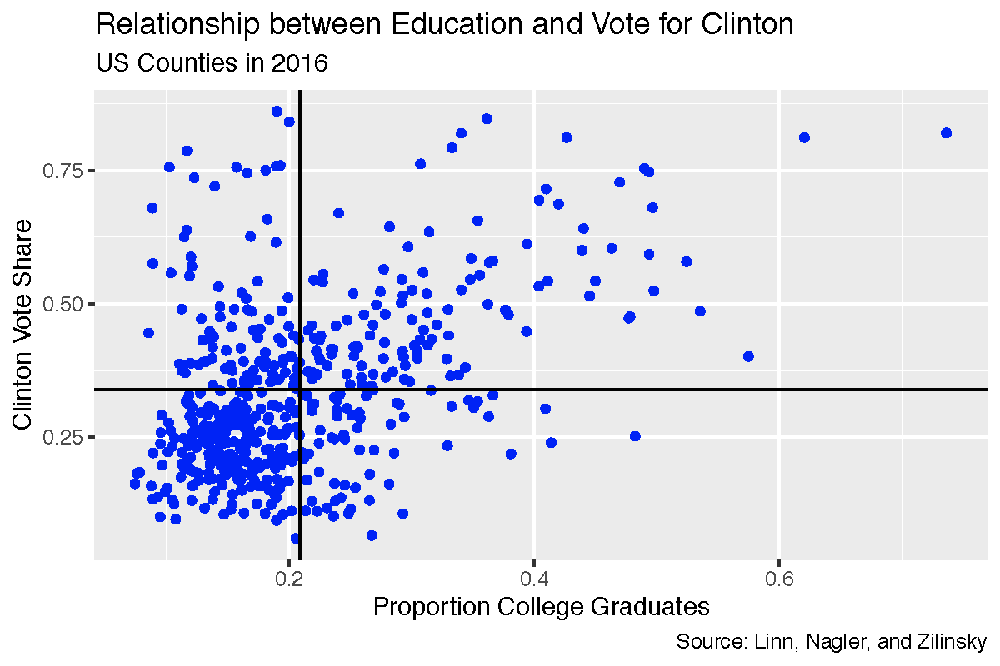
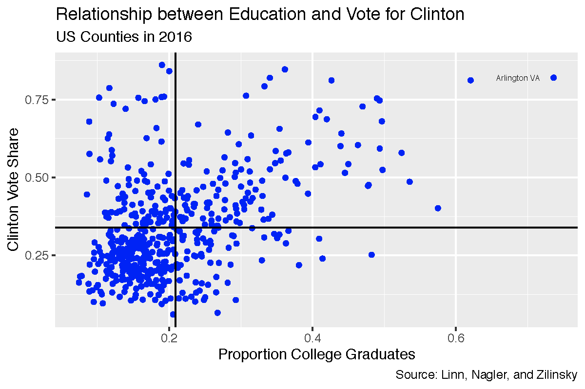

## Learning Objectives

In this tutorial, you will continue learning how to describe the relationship between two variables. This time we will focus on how to do so when both variables are measured at the interval level. Specifically, we will cover:

* How to conduct a descriptive analysis of the relationship between interval variables with scatter plots using the `ggplot()` function in the R package <span style="color:DarkGreen">ggplot2</span>.
* How to conduct a descriptive analysis of the relationship between two interval variables using Pearson's correlation coefficient and plots.


```{r setup, include=FALSE}
library(learnr)
library(tidyverse)
library(knitr)
library(poliscidata)
library(descr)
library(ggplot2)
library(gradethis)
tutorial_options(exercise.checker = gradethis::grade_learnr)
tutorial_options(exercise.timelimit = 60)
knitr::opts_chunk$set(error = TRUE)
counties <- qpaTutorials::counties
counties$employ_pop_ratio_25_64 <- counties$employ_pop_ratio_25_64*100
counties$dem2p_percent <- counties$dem2p_vote_share*100
counties$rural <-1
counties$rural[counties$rural_urban<=3] <- 0
counties$rural[counties$rural_urban>=8] <-2

fHouse <- qpaTutorials::fHouse
sum(is.na(fHouse$FHStatus))
#fHouse <-filter(fHouse, FHStatus==)
fHouse$FHStatus2[fHouse$FHStatus=="NF"] <- 0
fHouse$FHStatus2[fHouse$FHStatus=="PF"] <- 1
fHouse$FHStatus2[fHouse$FHStatus=="F"] <- 2
fHouse$FHStatus2[fHouse$FHStatus=="NA"] <- NA

fHouse$FHStatus<-fHouse$FHStatus2
#fHouse$FHStatus <- factor(fHouse$FHStatus, ordered=TRUE, levels = c("NF", "PF", "F"))
world <- world
```


## Bivariate Description

In the previous tutorials on bivariate description, we considered how to describe the relationships between variables measured at the nominal and/or ordinal level. We presented two tools available to summarize these types of relationships. We produced and interpreted the information in a cross-tab, which is a table that shows the distribution of cases (counts or proportions) across values of the dependent variable for cases that have different values on the independent variable. We then showed how to visualize the information in the cross-tab using a grouped bar plot. 

In the last tutorial, we considered how to conduct a descriptive analysis of the relationship between an interval variable and a nominal/categorical (or ordinal) variable. Typically we either compare a single summary statistic, the mean, or we compare the distribution of the interval variable for each of the values of the nominal or ordinal variable. 

If our interest lies in the relationship between two interval level variables, we can summarize the relationship between them using Pearson's correlation coefficient. The  <span style="color:blue">**correlation coefficient quantifies the strength and direction of the linear association between two interval level variables**</span>.  The logic of correlation is most easily understood in the context of a scatter plot. So we will introduce them first. A scatter plot provides a visual display of the nature, degree, and strength of the relationship between two interval level variables. It presents pairs of values for each unit of analysis on two variables measured at the interval level. The position of each dot on the horizontal and vertical axis indicates values for an individual data point.


Let's start with a picture of a scatter plot:

{ width=70% }

This scatter plot shows the relationship between the two interval level measures **dem2p_vote_share**, the share of the presidential vote cast for Hillary Clinton in 2016, and **prop_college_grad**, the proportion of college graduates in US counties. Each dot represents one unit of analysis, i.e., one county. Its placement on the x-axis represents its value on the variable plotted on the x-axis, i.e., proportion college graduates. It's placement on the y-axis represents its value on the variable plotted on the y-axis, i.e., proportion voting for Clinton. The horizontal (vertical) line is located at the mean value of the proportion voting for Clinton (proportion college graduates).

Consider the point in the upper right and labeled Arlington, VA. This point corresponds to 0.74, the share of adults who graduated college, (plotted on the x-axis) and a 0.82 share of the votes cast for Clinton (plotted on the y-axis).

{ width=70% }

Points -- like Arlington county VA -- in the upper right quadrant have values of **prop_college_grads** above the mean and values of **dem2p_vote_share** above the mean. Points in the lower left quadrant have values of **prop_college_grads** below the mean and values of **dem2p_vote_share** below the mean. When points are clustered in these two quadrants -- as in this example -- there is a positive relationship between the two variables.

Scatter plots are widely used and very informative about the nature of the relationship between two interval level variables. We can use the summary statistic, Pearson's correlation coefficient, to quantify the strength and direction of the relationship. Pearson's correlation coefficient, denoted  $r$, is given by the following formula:

$$r=\frac{1}{n-1} \Sigma \frac{ (x_i-\bar{x}) (y_i-\bar{y}) }{s_x s_y}$$
where

+ $x_i,y_i$ are the individual unit observations of $x$ and $y$, respectively
+ $\bar{x},\bar{y}$ are the sample means of $x$ and $y$, respectively
+ $s_x,s_y$ are the sample standard deviations of $x$ and $y$, respectively
+ $n$ is the sample size

Think through what this formula tells us.  When unit $i$'s value of both $x$ and $y$ are  above (or below) $\bar{x}$ and $\bar{y}$, $i$'s contribution to $r$ is positive. The more often that is true in our data, the greater $r$. In contrast, when  unit $i$'s  value is greater than the mean on one variable and less than the mean on the other, $i$'s contribution to $r$ is negative. The more often that is true in our data, the more $r$ will be negative.  If there is no systematic relationship between $x$ and $y$ then $r=0$.

The value of $r$ ranges between -1 and +1. 

+  $r>0$ indicates a positive relationship between $x$ and $y$: as one gets larger, the other gets larger.
+ $<0$ indicates a negative relationship: as one gets larger, the other gets smaller.
+ $r=0$ indicates no linear relationship.

Below is a picture illustrating the relationship between the pattern in a scatter plot and the correlation coefficient, $r$. A line is drawn through the points such that it is as close to all the points as possible. This helps us to gauge the relationship.  If the line is downward sloping (goes from upper left to lower right), as on the left, the correlation will be negative: higher values of one variable are associated with lower values of the other variable. If the line is upward sloping (goes from lower left to upper right), as on the right, the correlation will be positive: higher values of one variable are associated with higher values of the other variable. Finally, when the line is flat, as in the plot in the middle, there is no correlation between the two variables.  The steepness of the line is positively related to the strength of the correlation.

{ width=70% }

## Scatter plots

We follow the same basic steps to produce a scatter plot using `ggplot()` in the R package <span style="color:DarkGreen">ggplot2</span> as we have previous plots.

1.  Tell `ggplot()` the data that contains the variable(s) to plot.  
2.  Tell `ggplot()` which variable(s) to plot and on which axis. We do this by mapping the variables to the appropriate axis using the `mapping` argument and the `aes()` function. This time we need to specify a variable for each the x and y axis. By convention, the outcome variable is on the y-axis.
3.  Tell `ggplot()` how to plot the data by adding a **geom** layer. To create a scatter plot we use `geom_point()`.
4.  Add layers that make the plot more informative by adding labels and formatting scales.


To illustrate how to make a scatter plot we will ask the question how solid is support for democracy around the world? The data set **fHouse** contains the variables **Pro.Dem** and **FHTotalAggr**. **ProDem** is coded as the percent of respondents in a country that said "very good" or "fairly good" in response to the following question asked in the World Values Survey (Wave 5, 2005-2008) and the European Values Survey (2008):

>“I’m going to describe various types of political systems and ask what you think about each as a way of governing this country. For each one, would you say it is a very good, fairly good, fairly bad or very bad way of governing this country? ...Having a democratic system?

**FHTotalAggr** is the Freedom House (2017) measure of a country's composite level of democracy based on civil liberties and political rights, Freedom House, 2017. Higher scores are more democratic. 

We might hypothesize the following: <span style="color:chocolate"> In a comparison of [countries], those having [a higher level of democracy] will be more likely to [have higher support for democratic government] than will those having [a lower level of democracy].</span>

I've loaded the <span style="color:DarkGreen">ggplot2</span> package for you. Try to make a scatter plot based on the instructions above.


```{r scatter1, exercise=TRUE}
library(ggplot2)
 
```

```{r scatter1-hint-1}
The first argument of ggplot is data, here **fHouse**.
The second argument is mapping and should be set to
aes(), where we specify the x-axis variable (Pro.Dem) with the x
argument and the y-axis variable (FHTotalAggr) with the y argument.

End the line with a +!
```

```{r scatter1-hint-2}
We want to plot points, so specify the geom_point
function. You don't need to give it any arguments.
```


```{r scatter1-solution}
library(ggplot2)
ggplot(data = fHouse, mapping = aes(x = Pro.Dem, y = FHTotalAggr)) +
  geom_point() 
```

```{r scatter1-check}
grade_code()
```

Before we interpret our plot, let's clean it up!  The output above provides a warning that it has "Removed 125 rows containing missing values (geom_point)."  We can avoid this by filtering out the missing values using the `filter()` function in the <span style="color:DarkGreen">dplyr</span> package and piping the result to `ggplot()`. 


I'm going to make the points purple by specifying `color = "purple"` inside the `geom_point()` function. Try editing the plot to pick a new color (For a list of the color names available see http://www.stat.columbia.edu/~tzheng/files/Rcolor.pdf)

I'm also going to add a `geom_smooth()` layer to the plot (remember the plus sign). This adds a line through the points and aids in our interpretation. I'm making the line orange using the `color` argument inside `geom_smooth()`, telling ggplot not to add standard errors around the line (`se = FALSE`), and to use the method of least squares to draw the line (`method = "lm"`). We will talk more about least squares lines in the coming classes.

We need to load the <span style="color:DarkGreen">dplyr</span> package with the `library()` function.

Look carefully at the code to make sure you understand what each line of the code is doing. You will be asked to make your own scatter plots in class.

```{r scatter2, exercise=TRUE}
library(dplyr)
fHouse %>%
  filter(!is.na(FHTotalAggr), !is.na(Pro.Dem)) %>%
  ggplot(mapping = aes(x=Pro.Dem, y = FHTotalAggr)) +
  geom_point(color = "purple") +
  geom_smooth(color = "orange", se = FALSE, method = "lm") +
  labs(title = "Support for Democratic Values \nand Level of Democracy", 
       x = "Support for Democratic Rule", 
       y = "Level of Democracy", 
       caption = "Source: WVS and EVS, 2005-2008, \nFreedom House 2017") 
```


We can see that the points are quite widely scattered. In other words, there does not appear to be a strong relationship between the two variables. The line through the points is downward sloping but fairly flat, which also points to a weak (negative) relationship. There is no support for our hypothesis.

For more on scatter plots with `ggplot()` see: http://t-redactyl.io/blog/2016/02/creating-plots-in-r-using-ggplot2-part-5-scatterplots.html.


## The `cor()` function

Let's quantify the strength and direction of the linear relationship by calculating Pearson's correlation coefficient.

The `cor()` function in base R will accomplish this task. We will pass the function 4 arguments. The first two arguments are `x` and `y`, the two interval level variables for which we desire the correlation coefficient. In addition, we need to include the `use` argument if there are any missing values. It tells R how to handle them. The default method ("everything") will return NA if there are missing values in any variables. We will set `use = "pairwise.complete.obs"`. This means the function will include a unit (country in our example) if both units have a value on both variables. Finally, we need to tell the function the specific correlation measure to compute. We do so by setting the `method` argument equal to "pearson".


```{r Pr, exercise=TRUE}
cor(x = fHouse$Pro.Dem, y = fHouse$FHTotalAggr, use = "pairwise.complete.obs", method = "pearson")
```

The result, $r=-0.04$, is negative and close to zero. Thus we conclude that the relationship between these two variables is negative and weak. Perhaps surprisingly, there appears to be next to no relationship between support for democracy and level of democracy.

The data frame **fHouse** also contains the variable **Pro.Strong.Leader**. This is an interval variable that records the percent of respondents in a country that said "very good" or "fairly good" in response to the following question asked in the World Values Survey (Wave 5, 2005-2008) and the European Values Survey (2008):

> “I’m going to describe various types of political systems and ask you about each one as a way of governing the country. For each one, would you say it is a very good, fairly good, fairly bad or very bad way of governing this country?” ... “Having a strong leader who does not have to bother with parliament and elections?”


We might hypothesize the following: <span style="color:chocolate"> In a comparison of [countries], those having [a higher level of democracy] will be more likely to [have lower support for a strong leader] than will those having [a lower level of democracy].</span>

Edit the code below to produce a scatter plot illustrating the relationship between this variable and level of democracy (**FHTotalAggr**) from our previous example. We will begin by filtering out the missing values.  Try making the points blue and adding a red line.

```{r scatter2b, exercise=TRUE}
fHouse %>%
  filter(XXXX(FHTotalAggr), XXXX(Pro.Strong.Leader)) %>%
ggplot(mapping = aes(x = Pro.Strong.Leader, y = FHTotalAggr)) +
 geom_point(XXXX) +
  geom_smooth(XXXX) +
  labs(title = "Support for Democratic Values \nand Level of Democracy",
       x = "Support for a Strong Leader", 
       y = "Level of Democracy", 
       caption = "Source: WVS and EVS, 2005-2008, \nFreedom House 2017")
```

```{r scatter2b-hint-1}
Did you filter by selecting rows of the data frame fHouse 
that are not missing using !is.na? (Don't forget to 
pipe the results to ggplot).
Did you pass geom_point() color = "blue"?
Did you pass geom_smooth()  color = "red", eliminate 
the se by setting that argument to FALSE, and set 
the method argument to "lm"?
```

```{r scatter2b-solution}
fHouse %>%
  filter(!is.na(FHTotalAggr), !is.na(Pro.Strong.Leader)) %>%
ggplot(mapping = aes(x = Pro.Strong.Leader, y = FHTotalAggr)) +
 geom_point(color = "blue") +
  geom_smooth(color = "red",se = FALSE, method = "lm") +
  labs(title = "Support for Democratic Values \nand Level of Democracy",
       x = "Support for a Strong Leader", 
       y = "Level of Democracy", 
       caption = "Source: WVS and EVS, 2005-2008, \nFreedom House 2017")
```

```{r scatter2b-check}
grade_code()
```

We can see the relationship is negative. For countries in which there is more support of a strong leader there  tends to be less support for democracy.

Edit the code below to estimate Pearson's correlation coefficient.

```{r Pr2, exercise=TRUE}
cor(XXX = XXX, y = XXX$XXX, use = XXX, method = "XXX")
```

```{r Pr2-solution}
cor(x = fHouse$Pro.Strong.Leader, y = fHouse$FHTotalAggr, use = "pairwise.complete.obs", method = "pearson")
```

```{r Pr2-check}
grade_code()
```

What can we conclude? There is support for our hypothesies: There is a small magnitude negative correlation, approximately -0.283. Higher levels of support for a strong leader are  associated with lower levels of institutional democracy (and vice versa).

Finally, let's examine the relationship between **wage_growth** and **dem2p_vote_share** in the data frame **counties**.  **wage_growth** is an interval level variable that records the rate at which wages grew (or fell) over the last four years in a county. **dem2p_vote_share** is an interval level variable measuring the share of the vote for the Democrat, Hillary Clinton, in a county in 2016. This is a case where the outcome variable is clearly identifiable: **dem2p_vote_share**. So we will place it on the x-axis. Before creating the scatter plot, filter out any missing values. Make the points "blue" and add an "lm" line to the plot without standard errors (ser `se = FALSE`). Make the line "red". In the code below I've added the labels for you.

```{r scatter3, exercise=TRUE}
counties %>%
  XXXX
  XXXX
  XXXX
  XXXX
  labs(title = "Wage Growth and Support for Hillary Clinton",
       subtitle = "US Counties 2016",
       x = "Wage Growth", 
       y = "Democratic Vote Share", 
       caption = "Source: Linn, Nagler, and Zilinsky")
```

```{r scatter3-hint-1}
Did you filter by selecting rows of the data frame fHouse 
that are not missing using !is.na? (Don't forget to 
pipe the results to ggplot).
```

```{r scatter3-hint-2}
For the second XXXX call gpplot(). You don't need to specify data because
we've piped the filtered data to ggplot(). You do need to specify the mapping
argument with the aes() function and specify x=wage_growth and y=dem2p_vote_share
```

```{r scatter3-hint-3}
Did you add geom+point() and pass it color = "blue"?
Did you pass geom_smooth()  a color, eliminate the se 
by setting that argument to FALSE, and set the method
argument to "lm"?
Did you include a plus to add each layer to the plot?
```


```{r scatter3-solution}
counties %>%
  filter(!is.na(wage_growth), !is.na(dem2p_vote_share)) %>%
ggplot(mapping = aes(x = wage_growth, y = dem2p_vote_share)) +
 geom_point(color = "blue") +
  geom_smooth(color = "red", se = FALSE, method = "lm") +
  labs(title = "Wage Growth and Support for Hillary Clinton",
       subtitle = "US Counties 2016",
       x = "Wage Growth", 
       y = "Democratic Vote Share", 
       caption = "Source: Linn, Nagler, and Zilinsky")
```

```{r scatter3-check}
grade_code()
```


This plot shows many counties grouped with low positive growth and that these counties had a wide range of vote share for Hillary Clinton.

Now let's estimate the correlation coefficient between these two variables.

```{r Pr3, exercise=TRUE}

```

```{r Pr3-hint-1}
Did you call the cor() function and pass 4 arguments?
  x, y, method, and use?
```

```{r Pr3-solution}
cor(x = counties$wage_growth, y = counties$dem2p_vote_share, use = "pairwise.complete.obs",  method = "pearson")
```

```{r Pr3-check}
grade_code()
```

## The Takeaways

The key things to remember about examining the relationship between variables measured at the interval level are:

1. We  can summarize the relationship between two interval variables using <span style="color:blue">Pearson's correlation coefficient</span>. The correlation coefficient ranges between -1 and +1. Negative values indicate an inverse relationship between two variables: higher values of one variable are associated with lower variables of another. Positive values indicate a direct relationship: higher values of one variable are associated with higher variables of the other variable (and lower values with lower values).  The closer the correlation coefficient is to zero, the weaker the relationship. It is important to remember that the correlation coefficient assesses the strength and direction of a linear relationship. Not all relationships are linear. If a scatter plot reveals a relationship that is not linear, the correlation coefficient is meaningless.
2. We can visualize the relationship between two interval variables with a scatter plot using `ggplot()` in the <span style="color:DarkGreen">ggplot2</span> package using  `geom_point()`. We can add a line to the plot that goes through the points such that it is as close to all the points as possible using the `geom_smooth()` function.  If the line is downward sloping (goes from upper left to lower right), the correlation will be negative: higher values of one variable are associated with lower values of the other variable. If the line is upward sloping (goes from lower left to upper right),  the correlation will be positive: higher values of one variable are associated with higher values of the other variable. Finally, when the line is flat, there is no correlation between the two variables.  The steepness of the line is positively related to the strength of the correlation.


## Test your Knowledge

We've now completed three tutorials on describing relationships between two variables. Test your knowledge by answering the following questions.


```{r letter-z, echo=FALSE}
question("Which of the following statements is true",
  answer("We describe the relationship between two categorical variables by comparing the mean of one variable for categories of the other variable", correct=FALSE, message = "We do not summarize a caetgorical variable with a mean, so this is inapproprite. "),
  answer("A cross-tab illustrates the relationship between two categorical variables", correct=TRUE, message="Cross-tabs show the distribution of one categorical variable given values of another categorical variable. "),
  answer("The relationship between two interval variables is illustrated by comparing their distributions across categories. ", correct=FALSE, message = "We illustrate the relationship between interval variables using scatter plots. "),
  allow_retry = TRUE,
  try_again = " "
)
```


```{r letter-y, echo=FALSE}
question("Which of the following statements are true",
  answer("If Pearson's correlation coefficient, $r$, is near zero, there is evidence that the variables are not related to each other. ", correct=TRUE, message="The closer a correlation is to zero, the less strongly the two variables are related. "),
  answer("If Pearson's correlation coefficient, $r$, =0.6, there is a fairly strong tendency for values of x above the mean to occur with values of y above the mean and values of x below the mean to occur with values of y above the mean. ", correct = FALSE, message="A positive correlation occurs when values of x & y above the mean tend to toccur together AND values of x & y below the mean tend to occur together . "),
  answer("If x is hours spent studying and y is correct answers to homework, we expect a negative correlation", correct = FALSE, message="Since studying should improve performance higher x should be systematically related to higher y and thus we expect a positive correlation. "),
  answer("If x is your skill at golf and y is your golf score, we expect a negative correlation", correct=TRUE, message = "The more skilled at golf, the lower your score and thus we expect a negative correlation."),
  allow_retry = TRUE,
  try_again = "Hint: Select all true statementss."
)
```

Consider the following cross-tab between the effective number of parliamentary parties in a country, **enpp3_democ**, and whether or not the country is a member of the European Union, **eu**, and answer the question:

```{r, echo=FALSE}
library(descr)
CrossTable(x = world$eu, y = world$enpp3_democ, prop.r = FALSE, prop.c = TRUE, prop.t = FALSE, prop.chisq = FALSE)
```

```{r letter-x, echo=FALSE}
question("Which of the following statements are true",
  answer("Of countries with 1-3 political parties, almost 81% are not members of the European Union", correct = TRUE, message="There are 31 countries with 1-3 parties and 25 or 81% are not members of the EU. "),
  answer("Of EU member states, about 30% have 4-5 parties", correct=FALSE, message = "30.4 is the percent of countries with 4-5 parties who are members of the EU (69.6% are not). "),
  answer("The more parties a country has, the more likely they are to be members of the EU", correct = TRUE, message="As we move from fewer to more parties, the proportion of EU member states increases. "),
  allow_retry = TRUE,
  try_again = "Hint: More than one statement is true."
)
```

Consider the following scatter plot between government effectiveness (0 to 100 where 100 is more effective), **effectiveness**, and fertility rate (the number of children born per woman), **fertility**.

```{r, echo=FALSE, warning=FALSE, message=FALSE}
ggplot(data = world, mapping = aes(x = effectiveness, y = fertility)) +
  geom_point() +
  geom_smooth(method = "lm", se = FALSE, linetype = "dashed") +
  labs(title = "Government Effectiveness and Fertility Around the World",
       x = "Government Effectiveness Score",
       y = "Number of Children")
```


```{r letter-yyy, echo=FALSE}
question("Which of the following statements are true",
  answer("Each point represents a country's effectiveness on the x-axis and fertility on the y axis. ", correct=TRUE),
  answer("There is a positive correlation between effectiveness and fertility ", correct = FALSE, message="Because higher values of government effectiveness are associated with lower values of fertility, the correlation is negative. "),
  answer("The plot suggests a Pearson correlation close to zero", correct = FALSE, message="Randomly scattered points would suggest a correlation close to zero, but these are not randomly distributed. "),
  answer("There is a negative correlation between effectiveness and fertility. ", correct=TRUE, message = "Because higher values of government effectiveness are associated with lower values of fertility, the correlation is negative. "),
  allow_retry = TRUE,
  try_again = "Hint: More than one statement is true."
)
```