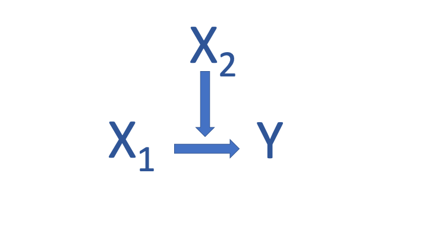

## Learning Objectives

In this tutorial, you will learn how to estimate and interpret interactive, also called conditional, relationships using R. Specifically, we will cover:

* How to conduct multiple regression analysis involving conditional relationships in R.
* How to interpret results from multiple regression analysis with interactions using the `plot_model()` function in the  <span style="color:DarkGreen">sjPlot</span> package to produce plots of predicted values.


```{r setup, include=FALSE}
library(learnr)
library(tidyverse)
library(knitr)
library(poliscidata)
library(stargazer)
library(sjPlot)
library(gradethis)
tutorial_options(exercise.checker = gradethis::grade_learnr)
#tutorial_options(exercise.timelimit = 60)
knitr::opts_chunk$set(error = TRUE)
library(rio)
trade <- qpaTutorials::trade
counties <- qpaTutorials::counties
counties$dem2p_percent <- counties$dem2p_vote_share*100
counties$lag_dem2p_vote_share <- counties$Linc2pvs*100
counties$wage_growth <- counties$wage_growth*100
counties$black_percent <- counties$prop_black*100
counties$white_percent <- counties$prop_white*100
counties$hispanic_percent <- counties$prop_hispanic*100
counties$college_grad_percent <- counties$prop_college_grad*100
counties$Majority_White[counties$prop_white>0.5] <- "Majority White"
counties$Majority_White[counties$prop_white<=0.5] <- "Not Majority White"
counties$Obama2p_percent <- counties$Linc2pvs*100
counties$College_percent <- counties$prop_college_grad*100
df <- qpaTutorials::df
df$region <- factor(df$region, labels =  c("South", "Northeast", "Midwest", "West"))
qog <- qpaTutorials::qog
qog$rights[qog$fh_pr<=2] <- 0
qog$rights[qog$fh_pr>2] <- 1

#The first line creates a new variable, UrbanCat which takes the value 0 if the county has a value of 7 or greater for the variable rural_urban
counties$UrbanCat[counties$rural_urban>=7] <- 0
#Next we recode UrbanCat to 1 when the value for the variable rural_urban is less than or equal to 3
counties$UrbanCat[counties$rural_urban<=3] <- 1
#Finally, we recode UrbanCat to -1 if the value of the variable is greater than 3 AND it is less than 7
counties$UrbanCat[counties$rural_urban>3 & counties$rural_urban<7] <- -1
qog$democ[qog$fh_ipolity2<4] <-0
qog$democ[qog$fh_ipolity2>6] <-2
qog$democ[qog$fh_ipolity2>=4 & qog$fh_ipolity2<=6] <-1
options(digits = 2)
options(scipen = 0)
options(width = 80)
states <- qpaTutorials::states
states$p.liberal <- states$liberal/100
states$region_censusf <- factor(states$region_census, 
                            labels =  c("South", "Northeast", "Midwest", "West"))
states$schoolchoif <- factor(states$schoolchoi, 
                                     labels =  c("No School Choice","School Choice"))
states$liberalf[states$p.liberal<.5] <-0
states$liberalf[states$p.liberal>=.5] <-1
countiesX <- lm(dem2p_percent ~  mortality_risk_25_45 + wage_growth + mortality_risk_25_45*wage_growth + college_grad_percent + hispanic_percent + white_percent + black_percent, data=counties)
countiesX2 <- lm(dem2p_percent ~  mortality_risk_25_45 + wage_growth +mortality_risk_25_45*white_percent + college_grad_percent + hispanic_percent +  black_percent, data=counties)
model1 <- lm(epi_epi ~ factor(rights) + ipi_tradeopen + factor(rights)*ipi_tradeopen + hf_efiscore, data=qog)
model2<-lm(confidence~factor(hi_gdp)+polity+factor(hi_gdp)*polity, data=world)

```


## Overview

Multiple regression allows us to estimate the effects of multiple independent variables on some interval-level  outcome variable.  This enables us to control for multiple correlated explanatory factors so that our estimates are unbiased and it enables us to avoid finding spurious relationships. It also permits the estimation of  <span style="color:blue">**conditional** or **interactive relationships** in which the effect of an explanatory variable depends on the values another variable takes (and vice versa).</span> In this tutorial, we explain how to estimate and interpret interaction models involving two interval-level variables and those involving one interval and one categorical variable using R and we illustrate how to visualize their effects.


## Conditional Relationships in Multiple Regression


If the effect of some variable depends on the level of another variable, the relationship is said to be <span style="color:blue">**conditional**</span> or <span style="color:blue">**interactive**</span>. Consider the image below.  The effect of $X_1$ on $Y$ differs based on the value of $X_2$.  Put differently, the value of $X_2$ determines the effect of $X_1$ on the outcome, $Y$.

 

<p align="center">
{ width=50% }
</p>

If we estimate a regression that includes $X_1$ and $X_2$ (or just one of these variables), the results will not correct identify the effects of either variable on the outcome.  We need to include $X_1 \times X_2$ in the model as well.


We need to think carefully about our expectations for conditional relationships. When specifying a conditional relationship you should ask yourself these questions:

1. <span style="color:magenta">Do you expect the conditional effect of a variable to be negative or positive for all values of the conditioning variable?</span> 
    a. Is the effect of $X_1$ positive or negative for all values of $X_2$?  
    b. Is the effect of $X_2$ positive or negative for all values of $X_1$? 
    
2. <span style="color:magenta">For what values of the conditioning variable do you expect its effect to be biggest and smallest?</span> 
    a. For what values of $X_2$ is the effect of $X_1$ strongest and weakest? 
    b. When is the effect of $X_1$ on $X_2$ likely to be biggest and smallest?

It is important to remember conditional relationships are symmetric: if $X_2$ conditions the effect of $X_2$, then $X_1$ must condition the effect of $X_2$ on $Y$. We must always consider our expectations for both variables in the interaction.

Interpretation of interactive effects depends on the level of measurement of $X_1$ and $X_2$. Below we illustrate how to estimate and interpret interactive relationships when $X_1$ and $X_2$ are both measured at the interval level and when one variable is interval and another categorical.

## Interpretation of Effects

 Consider the following regression where $X_1$ and $X_2$ are both measured at the interval level: 


$$Y_i = \hat{\alpha} + \hat{\beta}_1 X_{1,i} + \hat{\beta}_2 X_{2,i} + \hat{\beta}_3 X_{1,i}X_{2,i} + ... + \hat{\epsilon}_i$$

How do we interpret the conditional effects of $X_1$ and $X_2$ in this model?

1. $\hat{\beta_1}$ is the effect of $X_1$ on $Y$ when $X_2=0$.
2. $\hat{\beta_2}$ is the effect of $X_2$ on $Y$ when $X_1=0$.
3. $\hat{\beta_3}$ is the additional effect of $X_1 \times X_2$ on $Y$ when neither are 0.
4. $\hat{\beta_1}X_1$ + $\hat{\beta_3}X_1 \times X_2$ is the total effect of $X_1$ when both $X_1$ and $X_2$ are not zero: $\hat{\beta}_1 + \hat{\beta}_3X_2$.
5. $\hat{\beta_2}X_2$ + $\hat{\beta_3}X_1 \times X_2$ is the total effect of $X_2$ when both $X_1$ and $X_2$ are not zero: $\hat{\beta}_2 + \hat{\beta}_3X_1$.

The effect of $X_1$ on $Y$ is affected by the value of $X_2$; the effect of $X_2$ on $Y$ is affected by the value of $X_1$.

Because the effects are conditional, the nature (and even the direction or sign) of the effects are not necessarily the same for all values of the constituent variable (the individual variables comprising the interaction). Thus, analysts often present these effects by plotting predicted values for different combinations of values of the variables.  Below we will consider  a number of illustrative examples. We will (a) state our expectations for the conditional relationship, (b) estimate the conditional effects using the `lm()` function, and (c) plot predicted values to aid in our interpretation using the `plot_model()` function in the  <span style="color:DarkGreen">sjPlot</span> package.

### Example 1: The conditional effects of mortality risk and wage growth on vote for Hillary Clinton in US counties

We will use the data frame **counties**, which contains data on counties in the United States in 2016, to illustrate the estimation and interpretation of conditional relationships involving variables measured at the interval-level. Our goal is to estimate a model of the percent of the vote Hillary Clinton won in the 2016  presidential election (**dem2p_percent**). The explanatory variables in our model are mortality risk for adults age 25-45 (**mortality_risk_25_45**, measured as a percent), wage growth (**wage_growth**, measured as a percent), and the percent of a county's residents who are white (**white_percent**), black (**black_percent**), hispanic (**hispanic_percent**), and who have a college degree (**college_grad_percent**).

A number of hypotheses are implicit in the selection of this set of variables, but we will focus our attention on the potentially conditional effects of mortality risk and wage growth. We begin by considering our expectations for the conditional effects:

1. <span style="color:magenta">Do we expect conditional effects of each variable to always be positive or negative? </span>
    a. We expect the conditional effect of mortality risk to be negative for all values of wage growth because higher mortality risk is never a good thing.
    b. We expect the conditional effect of wage growth to be positive for all values of mortality risk because higher wage growth is always a positive thing.

2. <span style="color:magenta">When are the conditional effects of each variable expected to be weakest and strongest?</span>
    a. We expect the conditional effect of mortality risk to be biggest (most negative) when wage growth is lowest because these counties are suffering in two distinct ways and to be smallest (less negative) in counties with higher wage growth.
    b. We expect the conditional effect of wage growth on the percent of the vote won by Hillary Clinton to be smaller in counties that experience higher mortality risk because they are less well off on the health dimension and higher in counties with lower mortality risk because they are better off both in terms of health and economic outcomes.

If these expectations are accurate, then the relationship of each variable with **dem2p_percent** is conditional and we need to include **mortality_risk_25_45 * wage_growth** in our regression.

### Estimate the Regression

To estimate an interactive relationship, we include **mortality_risk_25_45**, **wage_growth**, and we include **mortality_risk_25_45 * wage_growth** as **mortality_risk_25_45 * wage_growth** in the model, along with our other independent variables as below.  Examine and run the code.

```{r model1, exercise = TRUE}
countiesX <- lm(dem2p_percent ~  mortality_risk_25_45 + wage_growth + mortality_risk_25_45*wage_growth + college_grad_percent + hispanic_percent + white_percent + black_percent, data=counties)
summary(countiesX)
```

Examine the output above carefully. 


```{r letter-a, echo=FALSE}
question("Which of the following statements is true?",
  answer("For every one unit (percentage point) increase in the percent of hispanic residents in a county, we expect Hillary Clinton's vote share to increase by about a quarter of a percentage point", correct=TRUE),
  answer("For every percentage point increase in the percent of white residents in a county, on average Hillary Clinton received about 0.56 percentage points fewer votes", correct=TRUE),
  answer("Our prediction error is less than 0.610 percentage points for more than half the cases", message="Our prediction error is 10.000 percentage points or less half the time as given by the residual standard error. The adjusted $R^2=0.6100$ telling us that the model accounts for almost 61% of the variation in the percent of the vote for Hillary Clinton"),
   answer("We can be 95% confident that each coefficient in the model is not zero", correct=TRUE, message="The slope tells us the expected change in the value of the dependent variable for a unit change in the independent variable. Therefore, for a one percentage point increase in the percent of hispanics in a county, the expected vote for Hillary Clinton increases by 0.260 percentage points and for every one percentage point increase in the percent of whites in a county it decreases by about 0.560 percentage points. Each coefficient in the model has a p-value < 0.05 so we can be 95% confident that each coefficient in the model is not zero."),
  allow_retry = TRUE,
  try_again = "Hint: There is more than one correct answer"
  )
```

### Interpreting the Coefficients

We can write out the regression equation as follows. 

$$ \hat{\textbf{dem2p_percent}_i}= 71.0 -2.5\textbf{mortality_risk_25_45} +0.75\textbf{wage_growth} \\+0.64\textbf{college_grad_percent}_i+0.26\textbf{hispanic_percent}_i-0.56\textbf{white_percent}_i\\+0.14\textbf{black_percent}_i-0.14\textbf{mortality_risk_25_45*wage_growth}_i + \varepsilon_i$$

Our focus in this tutorial is on interpreting the effects of the variables involved in the interaction. 

1. $-2.5$, the coefficient on $\mathbf{mortality\_risk\_25\_45}$, is the effect of mortality risk on $\mathbf{dem2p\_percent}$ when $\mathbf{wage\_growth}=0$.
2.  0.75, the coefficient on **wage_growth**, is the effect of wage growth when **mortality_risk_25_45**=0. (Note that mortality risk is never zero, there is always a positive chance of death.)
3. $- 0.14$ is the additional effect of mortality risk and wage growth on **dem2p_percent** when neither are zero.
4. $- 2.5$ * **mortality_risk_25_45** - 0.14 * **wage_growth * mortality_risk_25_45 is the total effect of mortality risk when both **mortality_risk_25_45** and **wage_growth** are not zero.
5. 0.75 * **wage_growth** - 0.14 * **mortality_risk_25_45** * **wage_growth** is the total effect of wage growth when both **mortality_risk_25_45** and **wage_growth** are not zero.

### Example 2: The conditional effects of mortality risk and percent whites in a county on vote for Hillary Clinton

Next consider a different potential interaction effect in our model of Hillary Clinton's vote share.  Let's estimate a model in which the effects of mortality risk and percent white residents in the county are allowed to be conditional. 

1. <span style="color:magenta">Do we expect the conditional effects of each variable to always be positive or negative?</span>
    a. We expect the conditional effect of mortality risk to be negative for all values of wage growth because higher mortality risk is never a good thing.
    b. We expect the conditional effect of the percent of white residents to be negative for all values of mortality risk because we expect whites to be less supportive of the Democratic candidate because the party divisions have historically been such that whites favor the Republican Party candidate.

2. <span style="color:magenta">When are the conditional effects of each variable expected to be weakest and strongest?</span>
    a. We expect the conditional effect of mortality risk to be biggest (most negative) when percent white is highest if counties with more whites are more sensitive to mortality risk and to be less negative in counties with fewer whites if whites are less sensitive.    
    b. We expect the conditional effect of percent white on the percent of the vote won by Hillary Clinton to be greater in counties that experience higher mortality risk if mortality risk makes whites more anti-incumbent.

If these expectations are accurate, then the relationship of each variable with **dem2p_percent** is conditional and we need to include **mortality_risk_25_45 times white_percent** in our regression.

Complete the code below to estimate the following model. Present the results using the `summary()` function.

$$ \hat{\textbf{dem2p_percent}_i}= \hat{\alpha} +\hat{\beta_1}\textbf{mortality_risk_25_45}+ \hat{\beta_2}\textbf{wage_growth} \\+\hat{\beta_3}\textbf{college_grad_percent}_i+\hat{\beta_4}\textbf{hispanic_percent}_i-\hat{\beta_5}\textbf{white_percent}_i+\\ \hat{\beta_6}\textbf{black_percent}_i+\hat{\beta_7}\textbf{mortality_risk_25_45*white_percent}_i + \varepsilon_i$$


```{r model2, exercise = TRUE}
countiesX2 <- 
```

```{r model2-hint}
Look at the regression model above for clues.

Make sure you use * for the interaction and not X to multiply.
```

```{r model2-solution}
countiesX2 <- lm(dem2p_percent ~  mortality_risk_25_45 + wage_growth +mortality_risk_25_45*white_percent + college_grad_percent + hispanic_percent +  black_percent, data=counties)
summary(countiesX2)
```

```{r model2-check}
grade_code("You are getting good at estimating regression models!")
```

Look carefully at the output above and answer the following questions.


```{r letter-b, echo=FALSE}
question("Which of the following statements is true?",
  answer("All independent variables are statistically significantly different from zero", correct=TRUE),
  answer("For every one percentage point increase in the vote for Hillary Clinton, the percent of black residents in a county increases by about 0.16 percentage points", message="For every one percentage point increase in the percent black residents in a county, on average Hillary Clinton received 0.16 percentage points more votes"),
  answer("For every one percentage point increase in the percent hispanic residents in a county, on average Hillary Clinton received 0.28 percentage points more votes", correct=TRUE),
  answer("The model explains about 62% of the variation in vote for Hillary Clinton", correct=TRUE),
  answer("The prediction error in our model for most cases is less than 10 percentage points", correct=TRUE, message="All p-values for the estimated coefficients are < 0.05 so we can reject the null hypothesis that each is zero. Because the slope tells us the expected change in the dependent variable for a unit change in an independent variable, for every one unit increase in the percent of blacks in a county, we expect the vote for Hillary Clinton to increase by 0.16 percentage points and for every one unit increase in the precent of hispanic residents we expect it to increase by 0.28 percentage points. The adjusted $R^2$ is 0.620. The percent of the variation in the dependent variable explained by the model is this quantity times 100 or 62%. The residual standard error tells us the prediction error from the model is less than 10 units of the dependent variable."),
  allow_retry = TRUE,
  try_again = "Hint: There is more than one correct answer"
  )
```


```{r letter-c, echo=FALSE}
question("Consider the conditional relationship estimated in the model. Which of the following statements is true?",
  answer("For every one point increase in mortality risk, vote for Hillary Clinton increases by 4.4 percentage points", message="It is not true that for every percentage point increase in mortality risk, vote for Hillary Clinton increases by 4.4 percentage points. The coefficient on mortality risk is the expected change in Hillary Clinton's vote **when there are no whites in a county**. "),
  answer("For every one point increase in the percent of white residents in a county, the expect vote for Hillary Clinton drops 0.18 percentage points *when mortality risk is zero*", correct=TRUE),
  answer("The total effect of mortality risk is given by adding 4.4 * **mortality_risk_25_45** and -0.09 * **mortality_risk_25_45** * **white_percent**", correct=TRUE, message="The slope on the constituent terms in an interaction gives the amount the dependent variable changes on average *when the other constituent term has a value of zero*. The total effect of  mortality risk is given by multiplying its value times its slope and adding to that quantity the coefficient on the interaction term times the values of mortality risk and times the percent of whites in a county: $\\beta_1X_1 + \\beta_3X_1X_2$."),
  allow_retry = TRUE,
  try_again = "Hint: There is more than one correct answer"
  )
```


## Visualizing Conditional Relationships Involving Interval-Level Variables

It is difficult to grasp the effect of interactions based only on the coefficient estimates. Plotting predicted values from the model helps us to understand conditional relationships.

We will use the `plot_model()` function in the <span style="color:DarkGreen">sjPlot</span> package to illustrate the relationship.

### Plotting the conditional effect of wage growth

Let's begin by plotting the  effect of mortality risk conditional on wage growth as estimated in our first model, **countiesX**. To do so, first load the <span style="color:DarkGreen">sjPlot</span> package with the `library()` function.  The first argument in the `plot_model()` function is the name of the model fit object, **countiesX**. We must then provide the `type` argument. We set it to `"pred"` to produce predicted values. To present predicted values for the conditional relationship, we supply the `terms` argument. List both variables that are involved in the interaction, in quotes, separated by commas, and inside the `c()` function. *The first argument listed is the variable whose effects we want to plot, the second is the conditioning variable*. 

The remaining arguments are not required but make the plot more informative. Here I've specified the `title` argument for the main plot title; the `axis.title` argument, which allows us to provide labels for the x-axis (the first given) and the y-axis (the second given); and the `legend.title`, which corresponds to the second variable in the `terms` argument. 


```{r plotcountiesX1, exercise = TRUE}
library(sjPlot)
plot_model(countiesX, 
           type="pred", 
           terms=c("wage_growth", "mortality_risk_25_45"),
           title = "Predicted Effect of Wage Growth by Mortality Risk", 
           axis.title = c("Wage Growth","Predicted Vote for Hillary Clinton (%)"),
           legend.title= "Mortality Risk")

```

The `plot_model()` function places the first `term` on the x-axis. Three values are selected for the second `term`(here **mortality_risk_25_45**), corresponding to the mean (3.08) in blue and one standard deviation above (4) and below (2.17) the mean, in green and red, respectively. Predicted values are presented on the y-axis for all values of **wage_growth**.  All other interval level variables are held at their mean when generating the predictions. (If there were nominal variables, they would be held at their base level.)

The shaded areas in the plot present confidence intervals around the predictions. Where these overlap, there is no discernible difference in the predicted values. Thus, we can see that the effect of wage growth on the predicted vote for Hillary Clinton is not significantly different for the three values of mortality risk plotted here for wage growth between about -15 and -35. The effect of mortality differs significantly, however, as wage growth increases in a county.

Look carefully at the plot. We can see that as wages go up, vote for Hillary Clinton increases regardless of the value of mortality risk.  But the effect of each one percentage point increases in wages is bigger when mortality risk is low (because the red line is steeper). This is consistent with our expectations.

What is the predicted percentage of the vote for Hillary Clinton when wages are flat (for **wage_growth** equal to zero) when the mortality rate is at its means value? To answer this question, imagine a horizontal line from the blue line when the x-axis value is zero to the y-axis. This is the predicted value, about 32 percent. 

### Plotting the conditional effect of mortality risk

What can we say about the effect of mortality risk? To plot the effect of **mortality_risk_25_45**, we create another plot, identical to the last but flipping the order of the `terms` and correcting the labels. Replace the XXX in the code and generate the plot.

```{r plotcountiesX1b, exercise = TRUE}
plot_model(countiesX, type="pred", 
           XXX=XXX,
           title = XXX, 
           axis.title =XXX,
           legend.title= XXX)

```


```{r plotcountiesX1b-hint}
Specify the terms argument as c("mortality_risk_25_45","wage_growth").

Change the title to say predicted effect of mortality risk by 
wage growth.

Specify the axis.title argument as "Mortality Risk","Predicted Vote for Hillary Clinton (%)" 
making sure to enclose them inside the c() function and 
separate with commas.

Change the legend.title to "Wage Growth"
```

```{r plotcountiesX1b-solution}
plot_model(countiesX, type="pred", 
           terms=c("mortality_risk_25_45","wage_growth"),
           title = "Predicted Effect of Mortality Risk by Wage Growth", 
           axis.title = c("Mortality Risk","Predicted Vote for Hillary Clinton (%)"),
           legend.title= "Wage Growth")

```

```{r plotcountiesX1b-check}
grade_code("Remember that the values of all other variables at their mean value, if interval, and at their base value if categorical.")
```


```{r letter-d, echo=FALSE}
question("Examine the plot above and select the statement that is true",
  answer("The effect of mortality risk on the predicted vote for Hillary Clinton is biggest when wages are lower", message="The slope is flattest when wages are lower, indicating that the effect of mortality risk changes less when wages are lower. "),
  answer("The effect of mortality risk on the predicted vote for Hillary Clinton is biggest when wages are higher", correct=TRUE, message="We can tell that the effect of mortality risk is biggest when wages are higher because the slope of the line is steepest in this case. "),
  answer("The effect of mortality risk is significantly different for all levels of mortality risk for each level of wage growth", message="The effect of mortality risk on Hillary Clinton's vote does not depend on wage growth when the confidence intervals overlap. "),
  allow_retry = TRUE
  )
```


### Practice

Let's practice producing predicted value plots for conditional relationships by plotting the effect of **mortality_risk_25-45** conditional on **white_percent** from **countiesX2**, the second model object we fit above.

Replace the XXX in the code and produce the plot.  Notice that I've added `[50, 86, 100]` after **white_percent** in the code below. We can pick the values of the second variable for which we wish to generate the plot. I've selected 50 and 100 as interesting values and 86 is the mean. You can pick whatever you want, however, for your own work (or use the function default).


```{r plotcountiesX2a, exercise = TRUE}
plot_model(XXX, XXX=XXX, 
           XXX="mortality_risk_25_45","white_percent[50, 86, 100]",
           title = "Predicted Effect of Mortality Risk by Majority White", 
           axis.title = c("XXX","Predicted Vote for Hillary Clinton (%)"),
           legend.title= "XXX")

```

```{r plotcountiesX2a-hint}
Replace the first XXX with the name of the model fit object.

Replace the second XXX with type argument and specify "pred"
for the next XXX.

The final XXX should be replaced with the name of the second 
term.
```


```{r plotcountiesX2a-solution}
plot_model(countiesX2, 
           type="pred", 
           terms=c("mortality_risk_25_45","white_percent[50, 86, 100]"),
           title = "Predicted Effect of Mortality Risk by Percent White", 
           axis.title = c("Mortality Risk","Predicted Vote for Hillary Clinton (%)"),
           legend.title= "Percent White")

```

```{r plotcountiesX2a-check}
grade_code("You are getting good at this.")
```


```{r letter-e, echo=FALSE}
question("Examine the plot above and select the statements that are true",
  answer("The effect of mortality risk on the predicted vote for Hillary Clinton is biggest when the percentage of whites is 100%", correct=TRUE, message="We can tell the effect of mortality risk is is biggest in counties with 100% white because the slope is steepest. "),
  answer("The effect of mortality risk on the predicted vote for Hillary Clinton is largest for counties with 50% white",  message="Regardless of the value of **mortality_risk_25_45**, its effect on the predicted vote for Hillary Clinton is essentially zero when there are 50% whites in a county because the slope of the line is essentially zero. "),
  answer("The effect of mortality risk is significantly different for these three levels of **white_percent**", correct=TRUE, message="The effect of mortality risk on Hillary Clinton's vote is significantly different for these values of the percent white because the confidence intervals do not overlap. "),
  allow_retry = TRUE,
  try_again = "Hint: There is more than one correct answer"
  )
```

Write code to produce a plot illustrating the effect of the percent white conditioned on the value of mortality risk in a county and run the code.  Use values of **mortality_risk_25_45** of 1 (low risk), 3 (approximately mean risk), and 5 (high risk) to generate the plot. For titles for your plot use "Predicted Effect of Percent White by Mortality Risk," "Percent White," and "Mortality Risk."


```{r plotcountiesX2b, exercise = TRUE}

```

```{r plotcountiesX2b-hint-1}
1. Call plot_model and specify in order the model fit object, 
the term argument, the title, axis.title, and legend. title 
arguments.
2. Specify type="pred".
3. Specify terms by listing white_percent first, a comma,
and mortality_risk_25_45[1,3,5] each in quotes inside c().
4. Specify the axis.title by listing "Percent White" 
followed by a comma and "Predicted Vote for Hillary Clinton (%)", 
listing these inside the c() function.
5. Specify the legend.title as "Mortality Risk".
```

```{r plotcountiesX2b-solution}
plot_model(countiesX2, 
           type="pred", 
           terms=c("white_percent", "mortality_risk_25_45[1,3,5]"),
           title = "Predicted Effect of Percent White by Mortality Risk", 
           axis.title = c("Percent White","Predicted Vote for Hillary Clinton (%)"),
           legend.title= "Mortality Risk")

```

```{r plotcountiesX2b-check}
grade_code("Nice plot!")
```


Your plot should show that the effect of percent white is always negative (all slopes are negative) and is biggest (the slope is steepest) for counties with the highest mortality risk when all other variables are held at their mean value. There is support for the expectation that higher mortality risk makes predominantly white counties more anti-incumbent than other counties.

## Interactions Involving One Categorical and One Interval Variable

Little changes when our interactions involve in interval and categorical variable. Consider the following regression where $X_1$ is a binary categorical variable and $X_2$ is an interval-level variable:


$$Y_i = \hat{\alpha} + \hat{\beta}_1 X_{1,i} + \hat{\beta}_2 X_{2,i} + \hat{\beta}_3 X_{1,i}X_{2,i} + ... + \hat{\epsilon}_i.$$

1. $\hat{\alpha}$ tells us the expected value of $Y$ when all the explanatory variables, including the interaction term, are zero. Thus it gives us the effect of being in the baseline category when $X_2$ and all other variables have a value of zero.
2. $\hat{\beta_1}$ is the difference in the expected value of $Y$ between cases in the baseline and the included category when $X_2$=0. 
3. $\hat{\alpha} + \hat{\beta_1}$ is the expected value of $Y$ for the included category when $X_2$ (and all other explanatory variables are zero).
4. $\hat{\beta_2}$ is the effect of $X_2$ on $Y$ when $X_1=0$, i.e., when the case is in the baseline category.
5. $\hat{\beta_3}$ is the additional effect of $X_2$ on $Y$ when neither are 0. Thus it is the additional effect of $X_2$ for the included category. The difference in the expected value of $Y$ between the two categories widens or shrinks as the value of the interval-level variable increases.


### Example 1: The conditional effects of political rights and trade openness on environmental performance

To illustrate interpretation of interaction terms involving a categorical and interval variable we will use the Quality of Government data set, **qog**, which has data from countries around the world. We will investigate the effects of trade openness (**ipi_tradeopen**, measured on a scale from 1-10, where 10 is most open), citizen political rights (**rights**, coded as 0 if a country's citizens have few political rights and 1 if they have many), and economic freedoms (**hf_efiscore**, measured on a scale from 0 to 100 where 100 is more freedoms) on a country's overall environmental health (**epi_epi**, measured on a scale from 0 to 100 where 100 is better performance). 

Let's assume we suspect that the effect of trade openness depends on the existence or lack thereof of political rights and that the effect of political rights depends on trade openness. Let's see what we find.

### Estimate the regression

Estimate the appropriate model. Save the result to **model1** and use the `summary()` function to examine your results.


```{r modelepi1, exercise = TRUE}

```

```{r modelepi1-hint-1}
1. Use the lm() function, specifying epi_epi as the dependent variable.
2. Type a tilde and then list rights inside the factor function plus
ipi_tradeopen + factor(rights)*ipi_tradeopen + hg_efiscore
3. Be sure to include the data argument, setting it equal to qog
4. Examine your results with summary(model1)
```

```{r modelepi1-solution}
model1 <- lm(epi_epi ~ factor(rights) + ipi_tradeopen + factor(rights)*ipi_tradeopen + hf_efiscore, data=qog)
summary(model1)
```

```{r modelepi1-check}
grade_code()
```


Let's interpret the effects of the variables involved in the interaction. 

1. -7.399, the intercept tells us the expected value of the environmental protection index when a country's citizens have few political rights (**rights**=0) and there is no trade openness (**ipi_tradeopen**=0) and there are no economic freedoms (**hf_efiscore**=0).
2. 29.226, the coefficient on **rights**, is the difference in the expected value of the environmental protection index for country's that do not and do have lots of political rights when trade openness, **ipi_tradeopen**, = 0. So countries with lots of political rights have a score on the environmental protection index that is about 29 points higher.
3.-7.3999 + 29.226 = 21.8261 is the expected value of the environmental performance index for for countries with many political rights when a country scores zero on the trade openness index (and all other explanatory variables are zero).
4. 4.750, the coefficient on **ipi_tradeopen**, is the effect of each unit increase on the trade openness scale when a country has few political rights (**rights**=0). For these country's trade openness increases their environmental protection index score.
5. -4.629, the coefficient on the interaction term, is the difference in the effect of each unit increase on the trade openness scale when a country has many political rights (**rights**=1) compared to few. Thus, the effect of trade openness drops 4.629 when a country's citizens have many political rights. In fact, it nearly cancels out the main effect of 4.750.

### Plot the conditional effects of political rights

Let's plot the conditional effects of political rights for different values of trade openness. Replace the XXX and run the code.

```{r plotepi1, exercise = TRUE}
plot_model(model1, 
           type="pred", 
           terms=c(XXX, XXX),
           title = "Predicted Effect of Rights by Trade Openness", 
           XXX = c("Political Rights","Predicted Environmental Performance Index"),
           XXX= "Trade as Percent of GDP")

```

```{r plotepi1-hint}
Make sure to list the variable you want on the x-axis first in the terms argument.
(It should be rights.)
Did you specify axis.title and legend.title?
```

```{r plotepi1-solution}
plot_model(model1, 
           type="pred", 
           terms=c("rights", "ipi_tradeopen"),
           title = "Predicted Effect of Rights by Trade Openness", 
           axis.title = c("Political Rights","Predicted Environmental Performance Index"),
           legend.title= "Trade as Percent of GDP") 

```

```{r plotepi1-check}
grade_code()
```

What does this plot tell us? Several things! The effect of political rights depends on trade openness only for those countries that have few political rights (**rights**=0). For levels of trade openness one standard deviation below the mean, we expect a relatively low score on the environmental performance index while for countries at the mean we expect a higher score and for those countries with trade openness one standard deviation above the mean, we expect an even higher score on the EPI index. These effects are statistically different from one another because the confidence intervals do not overlap. But the effect of having lots of political freedoms does not change based on a country's trade openness. 


Now plot the conditional effects of trade openness by replacing the XXX in the code below. Use "Trade as Share of GDP" and "Political Rights" for the omitted titles. Be sure to put them in the right place.

```{r plotepi1b, exercise = TRUE}
plot_model(model1, 
           type=XXX, 
           terms=c(XXX, XXX),
           title = "Predicted Effect of Trade by Rights", 
           axis.title = c(XXX,"Predicted Environmental Protection Index"),
           legend.title= XXX)

```
```{r plotepi1b-hint}
Did you set type to "pred"?
The terms argumbent should list ipi_tradeopen first, followed by rights,
both inside quotation marks
The axis.title should specify "Trade as Share of GDP" and the legend.title
"Political Rights"
```

```{r plotepi1b-solution}
plot_model(model1, 
           type="pred", 
           terms=c("ipi_tradeopen", "rights"),
           title = "Predicted Effect of Trade by Rights", 
           axis.title = c("Trade as Share of GDP","Predicted Environmental Protection Index"),
           legend.title= "Political Rights")

```

```{r plotepi1b-check}
grade_code()
```


```{r letter-f, echo=FALSE}
question("Examine the plot above and select the statements that are true",
  answer("The effect of trade openness on the predicted environmental performance index is larger when a country's citizens have many political rights", correct=FALSE, message="We can tell the effect of trade openness is larger when there are few political rights than many because the slope is steeper when they have few political rights. "),
  answer("The effect of trade openness on the predicted environmental performance index is smaller when a country's citizens have more political rights",  correct=TRUE, message="We can tell the effect of trade openness is larger when there are few political rights than many because the slope is steeper when they have few political rights. "),
   allow_retry = TRUE,
  try_again = "Try again"
  )
```


### Example 2: The conditional effects of a high GDP and democracy on confidence in institutions

For our second example illustrating interpretation of interaction terms involving a categorical and interval variable we will use data from countries around the world in the data frame **world**.  We will investigate the interactive effects of democracy (**polity**, measured on a scale from -10 to +10, where 10 is most democratic) and high versus low GDP (**hi_gdp**, coded as "Low GDP" and "High GDP"), on citizens confidence in the institutions of government (**confidence**, a scale from 0 to 100 where 100 is most confident).


### Estimate the regression

Estimate the appropriate model. Save the result to **model2** and use the `summary()` function to examine your results.

```{r modelconfidence, exercise = TRUE}

```

```{r modelconfidence-hint-1}
1. Use the lm() function, specifying confidence as the dependent variable.
2. Type a tilde and then list hi_gdp inside the factor function plus
polity + factor(hi_gdp)*polity
3. Be sure to include the data argument, setting it equal to world
4. Examine your results with summary(model2)
```

```{r modelconfidence-solution}
model2<-lm(confidence~factor(hi_gdp)+polity+factor(hi_gdp)*polity, data=world)
summary(model2)
```

```{r modelconfidence-check}
grade_code()
```


```{r letter-g, echo=FALSE}
question("Examine the output above and select the statements that are true",
  answer("The intercept tells us that the expected level of confidence in government institutions is about 57 points when a country has a zero on the Polity score and a low GDP", correct=TRUE, message="The intercept tells us the expected value of Y when all variables in the model are zero or at their base level. The base level of hi_GDP is Low GDP. "),
  answer("Countries with high GDP have an expected level of confidence that is 36.49 points lower on the confidence in government institutions scale than countries with a low GDP when the Polity score is zero", correct=TRUE, message="The slope coefficient on GDP tells us the difference in the expected value of Y when GDP is High compared to when it is Low when polity=0. "),
  answer("Among countries with a low GDP, each unit increase in the Polity democracy score yields a drop of 1.26 points in the confidence in government institutions index.",  correct=TRUE, message="The slope on the Polity democracy score tells us the effect of that variable when GDP is in the base category, here Low GDP. "),
  answer("The difference in the effect of each unit increase on the Polity democracy score when GDP is High, compared to when it is low, is 3.99.", correct=TRUE, message="The coefficient on the interaction term, is the difference in the effect of each unit increase on the polity score when a country is not in the base category (Low) compared to when it is. Thus, the effect of Polity increases by 3.99 when a country has a high GDP."),
   allow_retry = TRUE,
  try_again = "Hint: Have you selected all correct answers?"
  )
```


### Plot the conditional effect of a high versus low GPP

It is easier to understand the effect of interactions by plotting. Replace the XXX in the code below to generate the predicted effect of a high versus a low GDP conditioned on a countries Polity score. Notice that I've omitted the x-axis title as the labels provide all the necessary information to interpret the plot.

```{r plotmodel2-hint}
1. We use the plot_model function.
2. The type of plot we want is predicted values so set type to "pred".
3. Next we specify the terms argument, listing the variable we wish to plot on the
x-axis first, here "hi_gdp", and the conditioning variable second, here "polity."
```

```{r plotmodel2, exercise = TRUE}
XXX(model2, 
           type=XXX, 
           XXX=c(XXX, XXX),
           title = "Predicted Effect of High GDP by Democracy Score", 
           axis.title = c("","Predicted Confidence"),
           legend.title= "Polity Democracy Score")

```

```{r plotmodel2-solution}
plot_model(model2, 
           type="pred", 
           terms=c("hi_gdp", "polity"),
           title = "Predicted Effect of  GDP by Democracy Score", 
           axis.title = c("","Predicted Confidence"),
           legend.title= "Polity Democracy Score")

```

```{r plotmodel2-check}
grade_code()
```

Recall that the `plot_model()` function selects vaues of the Polity Democracy Score one standard deviation below the mean, the mean, and one standard deviation above the mean.

```{r letter-h, echo=FALSE}
question("Examine the plot above select the statements that are true",
  answer("Countries with a Polity score one standard deviation below the mean (1.2) and a low GDP have significantly higher confidence in government then countries with a Polity score of 1.2 and a high GDP", correct=TRUE, message="The point estimates in red are different and their confidence intervals do not overlap. Therefore, these differences are statistically significant. "),
  answer("Among countries with a low GDP, the predicted values of confidence in government institutions is significantly different for these values of the Polity score.",  correct=FALSE, message="Because the red, blue, and green confidence intervals overlap for countries with low GDP, the effect of the democracy score for these values of Polity is not significantly different."),
  answer("Among countries with a high GDP, those with a Polity score of 1.2 and 11.7 have a significantly different predicted level of confidence in government institutions.", correct=TRUE, message="Because the red and greed confidence intervals do not overlap for countries with a high GDP, countries with a Polity score of 1.2 and 11.7 have significantly different expected values of confidence in government institutions with countries with lower democracy scores have significantly lower confidence than those with higher democracy scores."),
   allow_retry = TRUE,
  try_again = "Hint: Did you select all correct answers?"
  )
```

Now, see if you can create the plot for the effects of democracy score on confidence, conditional on having a high versus low GDP. Give your plot the title "Predicted Effect of GDP by Democracy Score" and label the legend title "GDP", the x-axis title "Polity Democracy Score", and the y-axis title "Predicted Confidence".

```{r plotmodel2b, exercise=TRUE}

```

```{r plotmodel2b-hint}
1. Begin with the plot_model function and list model2 as the first argument.
2. Specify the type argument as "pred" to tell the function to plot predicted values.
3. Specify the terms argument to tell the function what effects you want to plot.
4. List the x-axis variable first. This is the variable whose effects you want to plot.
In this example, we want to plot the effects of democracy score, "polity".
5. Then list the conditioning variable, here "hi_GDP".
6. Add the title argument. Make sure to set it equal to the title in the instructions.
7. Add the axis.title argument. Remember the titles must be placed in quotes inside the c function.
Be sure to list the x-axis title first and the y-axis title second.
8. Specify the legend.title argument to name the legend "GDP"

```

```{r plotmodel2b-solution}
plot_model(model2, 
           type="pred", 
           terms=c("polity","hi_gdp"),
           title = "Predicted Effect of GDP by Democracy Score", 
           axis.title = c("Polity Democracy Score","Predicted Confidence"),
           legend.title= "GDP")
```

```{r plotmodel2b-check}
grade_code()
```


```{r letter-i, echo=FALSE}
question("Examine the plot above. TRUE or FALSE: The effect of democracy score on predicted confidence in governnment institutions is positive for countries with a high GDP and negative for a country with low GDP.",
  answer("TRUE", correct=TRUE, message="Because the slope of the line is positive for countries with a high GDP, increases in democracy scores lead to higher confidence for these countries and because the slope is negative for countries with a low GDP, increases in democracy scores lead to lower confdience for these countries."),
  answer("FALSE",  correct=FALSE, message="Because the slope of the line is positive for countries with a high GDP, increases in democracy scores lead to higher confidence for these countries and because the slope is negative for countries with a low GDP, increases in democracy scores lead to lower confdience for these countries. "),
   allow_retry = TRUE,
  try_again = "Try again"
  )
```


## The Takeaways


 Multiple regression analysis is a straightforward extension of simple regression analysis that allows us to control for competing explanations for some interval-level outcome and to estimate conditional or interactive  relationships. A <span style="color:blue">**conditional** or **interactive relationship** implies that the effect of each variable depends on the values taken by another.</span> Including conditional relationships in the model requires us to include each individual explanatory variable and in addition to include a term multiplying the two variables in the interaction.
 
It is important to think carefully about our expectations for conditional relationships, asking:

1. Do you expect the conditional effect of a variable to be negative or positive for all values of the conditioning variable? Put differently, is the effect of $X_1$ positive or negative for all values of $X_2$?  What about the effect of $X_2$? *We must always consider our expectations for both variables in the interaction.*
2. For what values of the conditioning variable do you expect its effect to be biggest and smallest? For what values of $X_2$ is the effect of $X_1$ strongest and weakest? When is the effect of $X_1$ on $X_2$ likely to be biggest and smallest?

We may not have clear expectations for both variables and/or for either one of these questions. That's okay!

Interpreting the effects of interactions is often most easily accomplished by using predicted values. The `plot_model()` function in the <span style="color:DarkGreen">sjPlot</span> package. The function will calculate the predicted values of the outcome variable (by setting the type argument to "pred") as a function of one variable (the first in the terms argument) conditional on the second variable (the second in the terms argument) in the interaction.  **Remember:** *Predictions are calculating after setting the values of all other variables at their mean values if interval (or ordinal treated as interval) and at their base value if they are categorical (nominal or ordinal).*  Ninety-five percent confidence intervals are included around the predictions, allowing you to see when predictions are significantly different from each other.

The results from these plots can be used to assess theoretical expectations about the nature of the conditional relationship. There are additional arguments that can be passed to the `plot_model()` function to generate predictions holding other variables are specific values. We'll cover these arguments in the context of logistic regression models. 

If your research question requires you to estimate conditional relationships you should check out http://www.strengejacke.de/sjPlot/articles/plot_interactions.html for additional examples and options for plotting predicted values with `plot_model()`.
