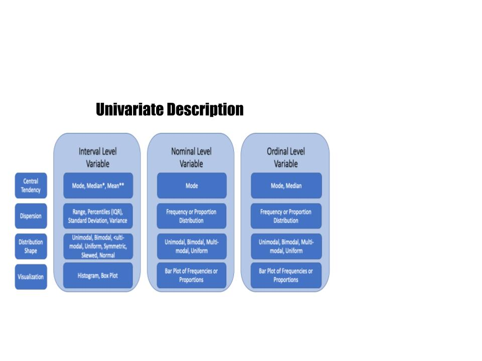

## Learning Objectives

In this tutorial, you will learn how to describe an interval level variable using summary statistics and plots. Specifically, we will cover:

* How to determine and describe the central tendency of an interval level variable
* How to use the `mean()` function
* How to summarize the dispersion of an interval variable
* How to create histograms and box plots using `ggplot()` in the package <span style="color:DarkGreen">ggplot2</span> with `geom_histogram()` and `geom_boxplot()`


```{r setup, include=FALSE}
library(learnr)
library(tidyverse)
library(knitr)
library(poliscidata)
library(gradethis)
tutorial_options(exercise.checker = gradethis::grade_learnr)
#tutorial_options(exercise.timelimit = 60)
knitr::opts_chunk$set(error = TRUE)
counties <- qpaTutorials::counties
counties$employ_pop_ratio_25_64 <- counties$employ_pop_ratio_25_64*100
counties$dem2p_percent <- counties$dem2p_vote_share*100
```

## Univariate Description

You are now getting familiar with the tools we use to describe the variables in our data, the first step in data analysis. We have covered methods for summarizing nominal and ordinal variables using the mode and median (for ordinal data but not nominal data), frequency and proportion distribution tables, and bar plots.  In this lesson, we look at the tools available for describing interval variables.

 


```{r letter-a, echo=FALSE}
question("Which of the following variables are interval level measures?",
  answer("The number of terrorist acts in the Middle East in a given year", correct = TRUE),
  answer("The poverty rate in a country", correct = TRUE),
  answer("The number of COVID-19 cases daily worldwide", correct = TRUE, message="Number of terrorist acts, poverty rate, and the number of COVID-19 cases are interval level because values are ranked and difference between them always mean the same thing. "),
  answer("Individual ideology measured on a scale of 1 to 7 from very liberal to very conservative", message = "Ideology is an ordinal variable with ranked differences that are not necessarily equal across the scale"),
  answer("The Polity democracy score measured on a scale from -10 (autocracy) to +10 (democracy)", message = "The Polity score is an ordinal variable because it is ranked but differences between values are not necessarily equal. Note, though, that analysts sometimes treat the differences as equal and therefore treat this variable as interval level. "),
  allow_retry = TRUE,
  try_again = "Have you selected all the interval level variables in this list?"
)
```

## Central Tendency

We can calculate the central tendency of an interval variable using the mode, median, *and* mean.  As we will see, the mode is typically not very informative, and the mean is highly sensitive to outliers (extreme values), but all three measures are appropriate for this level of measurement.  

We've already discussed the median. The median is the value in the middle when we list all values in rank order for all cases. Thus it is the value at the 50th percentile: half the cases have values at or below the median, and half have values at or above the median. 


You are likely very familiar with the mean, or average, value. We compute the arithmetic <span style="color:blue">**mean**</span> by summing the values taken by the individual cases and divide by the total number of cases:

$$\bar{Y} = \frac{Y_1 + Y_2  + ... + Y_n}{n} = \frac{1}{n} \Sigma_{i=1}^n Y_i$$

Can you tell why the mean is not an appropriate measure of central tendency for nominal and ordinal variables?  We cannot add up categories like married, single, divorced, and widowed. Even if they are coded numerically, what would the mean of marital status *mean*? It is also an inappropriate measure of central tendency for an ordinal variable. Although we may be able to add up the values of an ordinal variable, because the differences between them are not equal, the mean is misleading. 
 
While the mean is the most commonly reported measure of tendency, it suffers when there are outliers in the data. Let's say we wanted to calculate the central tendency of the income of patrons at a bar in State College. Like good data analysts, we calculate the median and mean. They are likely to be similar most nights, but what happens if Elon Musk walks into the bar? The median income is not affected, but the mean would increase dramatically!  For this reason, we say that the median is robust to outliers, but the mean is not.

### The mode

We calculated the mode of nominal and ordinal variables by examining the frequency and proportion table. Let's create a frequency and proportion table for the interval level variable **wage_growth** in the **counties** data frame. The variable measures the rate of growth in wages for all employed persons in a county compared to four years ago, at the time of the last presidential election.

Don't forget to load the <span style="color:DarkGreen">dplyr</span> package with the `library()` function. Name your frequency variable `freq` and your proportion variable `prop`. Try not to look at the hints!


```{r wagetable, exercise = TRUE, exercise.lines=4}

```

```{r wagetable-hint-1}
Remember we start with the data frame name 'and then' use
group_by, summarise, and mutate in conjunction with the pipe
operator.
```

```{r wagetable-hint-2}
Have you passed the variable wage_growth to group_by?
```

```{r wagetable-hint-3}
Have you calculated the frequencies using the summarise
function and n()?
```

```{r wagetable-hint-4}
Have you calculated the proportions using the mutate function
to generate a new variable equal to the frequency variable
divided by the sum of that variable?
```

```{r wagetable-solution}
library(dplyr)
counties %>%
  group_by(wage_growth) %>%
  summarise(freq=n()) %>%
  mutate(prop=freq/sum(freq))
```

```{r wagetable-check}
grade_code()
```

Can you see a problem?  What is the mode? The values of the variable are so precisely measured that no two counties have the exact same wage growth. This is often the case with interval level data. Even if two or three counties experienced the same growth in wages, the mode would not provide us with useful information about the typical county's wage growth. For this reason, we seldom calculate or present the mode of an interval variable.

### The median

Recall that we can calculate the median -- the value in the middle when we list all values in rank order for all cases -- using the `median()` function. 

Calculate the median  **wage_growth**:

```{r median, exercise = TRUE}

```

```{r median-hint}
Don't forget the na.rm argument
```

```{r median-solution}
median(counties$wage_growth, na.rm = TRUE)
```

```{r median-check}
grade_code()
```

The median value of wage growth is 0.047, implying that after ranking all counties' wage growth rates, the value at the 50th percentile was 0.047, or just under 5% wage growth.  Thus half the counties experienced wage growth at or less than 0.047 or 4.7%.

### The mean

We can calculate the mean using the `mean()` function. We pass the variable name for which we wish to calculate the statistic.  If there are any missing values in the data, we need to remember to use `na.rm=TRUE` so that these are omitted from the calculation. In fact, it is good practice to always include the `na.rm` argument when calling the `mean()` function.

Calculate the mean of **wage_growth**:

```{r mean, exercise = TRUE}

```

```{r mean-solution}
mean(counties$wage_growth, na.rm = TRUE)
```

```{r mean-check}
grade_code()
```

The mean value of wage growth is very similar to the median: 0.043. 

### Your turn

Let’s look at another interval variable. We will examine the variable **dem2p_percent**, the percent of the two-party vote cast for the Democrat in a given county, in the data frame **counties**.

Calculate the median and mean of this variable.

```{r demcentral, exercise = TRUE, exercise.lines=4}

```

```{r demcentral-hint-1}
Don't forget to use na.rm inside your functions
```

```{r demcentral-solution}
median(counties$dem2p_percent, na.rm=TRUE)
mean(counties$dem2p_percent, na.rm=TRUE)
```

```{r demcentral-check}
grade_code()
```

The median percent of the vote cast by counties for Hillary Clinton was just under 30%. Half the counties cast 30% or fewer votes for Clinton and half 30% or more. The mean percent of the vote for Clinton was similar at 33.34%. The difference in these two statistics suggests that some counties cast large percentages of the vote for Clinton, pulling the mean up relative to the median.

## Dispersion

There are many statistics available to describe the dispersion of an interval level variable. We will consider:

1. <span style="color:blue">**Range**</span>
2. <span style="color:blue">**Percentiles**</span>, especially the <span style="color:blue">**interquartile range**</span>
3. <span style="color:blue">**Variance**<span> and <span style="color:blue">**standard deviation**</span>


## Range 

The <span style="color:blue">**range**</span> of values a variable takes is given by the smallest (minimum) value and the largest (maximum)  value. As such, it provides book ends on the spread of the values of the variable across cases. It is useful to report the range  of the data in the sample because the sample range may be different from the theoretical range of the data. It can also help us to identify the presence of outliers.


### The range(), min(), and max() functions

The R function `range()` directly calculates both the minimum and maximum values in the data. The function `min()`  calculates the minimum value of a variable, and the `max()` function calculates the maximum value. Each function is passed the name of the variable we are analyzing. If there are missing values, we need to include the `na.rm` argument and set it equal to `TRUE` so that R drops the values before computing the statistic.

Let's calculate the range of the values of **wage_growth** to determine just how poor wage growth was in the least prosperous county and how strong wage growth was in the most prosperous county.  (Since wages can fall, wage growth need not be *growth* at all.) Enter code to calculate the range using the `range()` function and the `min()` and `max()` functions.


```{r minmax, exercise = TRUE}

```

```{r minmax-solution}
range(counties$wage_growth, na.rm = TRUE)
min(counties$wage_growth, na.rm = TRUE)
max(counties$wage_growth, na.rm = TRUE)
```

```{r minmax-check}
grade_code()
```


Wow! We see that the least prosperous county saw a drop of nearly $70\%$ in wages over 4 years. The most prosperous county's wages grew by almost as much.

## Percentiles

A <span style="color:blue">**percentile**</span> is the value of the variable that has a certain percentage of the data points below it.   In other words, the nth percentile of a data set is the value that cuts off the first n percent of the data values when all of the values are sorted from least to greatest. We've already worked with the 50th percentile -- it's the median value! The 90th percentile of a variable is the value that cuts off the bottom $90\%$ of the data values from the top $10\%$ of data values.

Percentiles can be used to answer questions such as:

>What is the longest life expectancy in a county for counties in the bottom quarter of all counties in terms of life expectancy? 

To answer this question, we'd find the 25th percentile of life expectancy across counties. This is the age that separates the bottom $25\%$ of values from the top $75\%$.

> What are the percentages of working-age adults who are employed that cover the middle half of all counties? 

To answer this question, we would find the 75th percentile of the proportion of working-age adults who are employed and the 25th percentile. These are the two values that determine the upper and lower bounds for the middle $50\%$ of the data.


The 25th and 75th percentiles comprise what is known as the <span style="color:blue"> inter-quartile range</span> or <span style="color:blue">IQR</span>. The IQR, splits the variable's values into four equal segments, or quartiles.  The advantage of the IQR as a measure of spread over the range is that any extreme values do not effect the IQR.


### The quantile() function

We can calculate percentiles with the `quantile()` function. By default, passing the variable name to the function will return the 0th, 25th, 50th,  75th, and 100th percentiles. (Be sure to include `na.rm=TRUE` if there are missing values for any case.) 

```{r percent, exercise=TRUE}
quantile(counties$wage_growth, na.rm=TRUE)
```

Note that the $0\%$ is the minimum and the $100\%$ is the maximum value, giving the range of the variable's values.

Let's focus on the interquartile range, the values at the 25th and 75th percentile, which demarcate the middle half of the data. The IQR tells us that the growth rate of wages for half the counties was between $0.025$ (or $2.5\%$) and $0.065$ (or $6.5\%$).  Notice how far removed from the middle the minimum and maximum values are. This suggests that there may be outliers in the data.

We can use the `quantile()` function to list additional percentiles by adding the `probs` argument inside the function. To list a specific set of percentiles set `probs=c(0.05, .1, .25, .5, .75, .9, .95)`.

```{r percent2, exercise=TRUE}
quantile(counties$wage_growth, na.rm=TRUE, 
         probs=c(0.05, .1, .25, .5, .75, .9, .95))
```

The result shows that 90% of the cases fall between -0.026 and 0.099. In other words, the bottom 5% of counties experienced declines in wage growth at or below 2.6% and the top 5% of counties experienced wage increases approaching 10% or higher.


### Your turn

Let's look at the 0, 25th, 50th, 75th, and 100th quantiles of the percent of working-age adults. This variable is named **employ_pop_ratio_25_64**, and it is located in the data frame **counties**.  Enter the code using the `quantile()` function:

```{r percentepr, exercise=TRUE}

```

```{r percentepr-hint}
Did you remember to include na.rm=TRUE?
```

```{r percentepr-solution}
quantile(counties$employ_pop_ratio_25_64, na.rm=TRUE)
```

```{r percentepr-check}
grade_code()
```

What is the range of the variable? $9.21\%$ to $668.07\%$. How can this be? Whenever you see percents that are greater than 100 it is possible that there is a data error. Here, the problem is that the numerator, employment, is calculated based on the number of people working in a county, and the denominator, population aged 25-54, is calculated based on the population in that county. Percentages greater than 100 will occur if many workers commute to a different county than that in which they live. This happens in big cities like New York City and Los Angeles.

The IQR is $51.23\%$ to $83.53\%$. This tells us that in half of the counties between about $51\%$ and $84\%$ of the population between the ages 25 and 54 are working.

We can also extract the median from the output. The middle value in the data is $66.61\%$. Half of the counties have that percent or less of the population between ages 25 and 54 working.

## Standard deviation (and variance)

The <span style="color:blue">**standard deviation**</span> tells us the average spread of values of a variable around (difference from) the mean value of the variable.  The <span style="color:blue">**variance**</span> is the squared standard deviation.
 
The formula for the standard deviation, denoted byt $s$, is
 
$$s=\sqrt{\frac{\Sigma_{i=1}^n({Y_i-\bar{Y}})^2}{n-1}}$$
 
 Let's pick this apart by considering an example where the variable of interest is the height of recent presidents. Below is a table listing the heights (in centimeters) of the last 10 presidents. In addition, the table presents the deviations in column three and deviations squared in column four that are given in the formula numerator above.  The last row of the table sums the values in the column. Thus we have the building blocks to calculate the standard deviation.
 

President | $Y_i$ | Deviation $(Y_i-\bar{Y})$ | Deviation$^2$ $(Y_i-\bar{Y})^2$
------- | ------- | ------- | -------
Trump | 188 | 188-184.7 = 3.3 |10.89 
Obama | 185 | 185-184.7 = 0.3 | 0.09 
Bush II | 182 | 182-184.7 = -2.7 | 7.29 
Clinton | 188 | 188-184.7 = 3.3 |10.89 
Bush I | 188 | 188-184.7 = 3.3 |10.89  
Reagan | 185 | 185-184.7 = 0.3 | 0.09 
Carter | 177 | 177-184.7 = -7.7 | 59.29 
Ford | 183 | 183-184.7 = -1.7 | 2.89 
Nixon | 180 | 180-184.7 = -4.7 | 22.09 
Johnson | 191 | 191-184.7 = 6.3 | 36.69
...  | $\bar{Y}=1/n \Sigma_{i=1}^n Y_i=184.7$ | $\Sigma_{i=1}^n({Y_i-\bar{Y}})= 0$ | $\Sigma_{i=1}^n({Y_i-\bar{Y}}) ^2=164.1$
 
Steps to calculate the standard deviation:

1. Calculate the deviation--how far above/below the mean: $(Y_i-\bar{Y})$-- for each observation (column three). Observations below the mean have negative deviations and above the mean have positive deviations.  If the variable is not very dispersed, the deviations will be close to the mean. Bigger deviations result in more dispersion.
2. By definition the average deviation will always be zero: deviations above the mean will offset the deviations below the mean. To avoid this problem, we square them (in column four).
3. Now we can calculate the mean of the squared deviations by summing these and dividing by not $n=10$, but $n-1=9$ (we'll see why later). The result is $164.1$.
4. If we stop here, we have the variance. Taking the square root gets us back to our original units and is called the standard deviation:

$$s=\sqrt{\frac{\Sigma_{i=1}^n({Y_i-\bar{Y}})^2}{n-1}}= \sqrt{\frac{164.1}{9}}=4.27$$

Note that $s$ is always positive.

Given the standard deviation of a variable, it may be hard to tell whether it is highly dispersed or not in any absolute sense, but it is easy to see that a sample with a standard deviation (for some variable) of 2 has less dispersion than one with 10.  The empirical rule can help us interpret the standard deviation.


## The Empirical Rule


The <span style="color:blue">**Empirical Rule**</span> tells us that if the distribution of observations is approximately bell-shaped (it is normal and symmetric, more later) then:

1. Approximately $68\%$ of observations fall between $\bar{Y}-s$ and $\bar{Y}+s$: over half of all of the observations will fall within one standard deviation of the mean.
2. About $95\%$ of observations fall within two standard deviations of the mean, between $\bar{Y}-2s$ and $\bar{Y}+2s$
3. Nearly all (over $99\%$) of the observation in the data in a normal distribution will fall within three standard deviations of the mean, between $\bar{Y}-3s$ and $\bar{Y}+3s$.


Below is a picture of two distributions. The red portion is shaded to denote $\bar{Y}-s$ and $\bar{Y}+s$; the green and red parts together illustrate $\bar{Y}-2s$ and $\bar{Y}+2s$; and the blue part extends to $\bar{Y}-3s$ and $\bar{Y}+3s$. The distribution on the left illustrates a smaller standard deviation while that on the left has a larger standard deviation. As you can see, the observations are clustered closer to the mean in the left-hand plot and further from the mean in the right-hand plot.


### The sd() function

To calculate the standard deviation, $s$, of a variable we use the `sd()` function, again including `na.rm=TRUE` to remove any observations with missing values for the variable.

```{r sd, exercise=TRUE}
sd(counties$wage_growth, na.rm=TRUE)
```

The standard deviation tells us the most of the observations are within $0.047$ or $4.7$ percentage points of the mean, which was $0.043$. Thus more than half of the observations are between $-0.004$ and $0.900$. Over $95\%$ of  the observations are plus or minus two standard deviations of the mean or between $0.043-0.047*2$ and $0.043+0.047*2$ or $-0.51$ and $0.137$. Nearly all the observations are between $0.043-0.047*3$ and $0.043+0.047*3$, or $-0.98$ and $0.184$. This suggests the observations with the minimum and maximum values ($-0.694$ and $0.626$) are outliers, which we should investigate further. They may be data errors or they simply be atypical counties.

## The shape of the distribution

Assessing the <span style="color:blue">**shape of the distribution**</span> of an interval variable is most easily done after visualizing the distribution in a plot. Let's do that and then discuss how we might describe the shape of the distribution.

. 

## Visualizing the distribution of an interval variable


For the same reason a frequency table is not a useful way to describe an interval variable, a bar plot is inappropriate for visualizing an interval variable. So what do we do with interval level variables? We can generalize the bar chart to illustrate the shape of the distribution of an interval level variable using a <span style="color:blue">**histogram**</span>. A histogram is a very common method for presenting the distribution of interval level data. Histograms collect observed values and put them in *bins* that cover *ranges* of values. Once in bins, the height of the bar is given by the number of values in that bin. We can also present a histogram using proportions. In this case, the height of the bar is calculated as the proportion of observations in the bin divided by the width of the bin (number of values covered by the bin). The total area in the bars sums to 1.0.  We can control the number of bins -- or their width -- or let R pick.

Histograms illustrate the central tendency of the variable and its dispersion, as well as the shape of the distribution.


###  The histogram

Generating a histogram with `ggplot()` requires a simple change to the basic code for a bar plot.  Because we want a different visual, or geometric, representation, we replace `geom_bar()` with `geom_histogram()`. That's it! (Note that we do not need to enclose **wage_growth** inside `factor()` because the variable can take on any value in its range.) 


```{r wagehist, exercise=TRUE}
ggplot(data=counties,  mapping=aes(x=wage_growth)) +
         geom_histogram() +
         labs(title = "Wage Growth in US Counties in 2016", 
              x=NULL, 
              y="Frequency", 
              caption="Linn, Nagler, and Zilinsky")
```

Ignore the warning for now and notice that it's difficult to determine the range of values covered by a bin. Let’s add white vertical borders demarcating the bins by adding a color = "white" argument to `geom_histogram()`.


```{r wagehist2a, exercise=TRUE}
ggplot(data=counties,  mapping=aes(x=wage_growth)) +
         geom_histogram(color="white") +
         labs(title = "Wage Growth in US Counties in 2016", 
              x=NULL, 
              y="Frequency", 
              caption="Linn, Nagler, and Zilinsky")
```


Notice that there is a warning message associated with the plot. "Pick better value with `binwidth`." `ggplot()` will choose 30 and give us a warning that we might wish to consider alternatives. To do so, we have two options. We can set the number of bins by adding the `bins` argument to `geom_histogram()` and setting it equal to some number. Try experimenting with the number of bins in our plot by augmenting the code and trying different values.


```{r wagehist2, exercise=TRUE}
ggplot(data=counties,  mapping=aes(x=wage_growth)) +
         geom_histogram(color="white") +
         labs(title = "Wage Growth in US Counties in 2016", 
              x=NULL, 
              y="Frequency", 
              caption="Linn, Nagler, and Zilinsky")
```

```{r wagehist2-hint-1}
Did you enter bins=50 or some other number inside geom_histogram()?
```

Alternatively, you can control the width of the bin. This sets the range of values covered by a bin. If a variable takes values that range from, for example, 0 to 100, we might want each bin to cover 10 units. We could specify `bins=10` (100/10=10) or set `bindwidth=10`. Let's set the binwidth for wage growth to 0.1 or one-tenth of a percentage point.

```{r wagehist2b, exercise=TRUE}
ggplot(data=counties,  mapping=aes(x=wage_growth)) +
         geom_histogram(color="white", binwidth=.01) +
         labs(title = "Wage Growth in US Counties in 2016", 
              x=NULL, 
              y="Frequency", 
              caption="Linn, Nagler, and Zilinsky")
```

Try experimenting with the binwidth in our plot to make sure you understand what this argument is doing.

Let's interpret the plot. What can we say about the shape of the distribution?

1. The distribution looks tightly clustered. The x-axis has such a broad range because there is a county with very large declines in wages (remember the range of the values from above) and a county with very large wage growth. If we ignored these two counties, the distribution would look much less tight as, in effect, we would zoom in on the remaining counties.
2. The distribution looks bell-shaped or similar to a normal distribution.
3. The distribution is fairly <span style="color:blue">**symmetric**</span>. This simply means the pattern to the left of the mean looks like that to the right. 


### Skew

Not all variables will have symmetric distributions. Instead, they may be <span style="color:blue">**skewed**</span>. Histograms are said to be skewed to the side of the long tail. The two histograms below are clearly not symmetric. The image on the left is skewed to the right. The image on the right is skewed to the left.


### Adding the median and mean to a histogram

Often it is useful to add a vertical line to a histogram to represent the median and/or the mean value. To do so, we add another layer to our plot.  We want to add a vertical line, so we will use the `geom_vline()` function. We need to tell R where to place the line and specifically where it crosses the x-axis. We do so by specifying an aesthetic inside `geom_vline()` and setting the `xintercept` argument equal to the value we wish. Let's add the median to our plot. We'll make the `linetype` `"dashed"` and `color` it `"red"` to make it stand out. I've also set `bins=60` in `geom_histogram()`. This means that the width of the bins will be the maximum value of wage growth minus the minimum value and this quantity will be divided by 60.

```{r vline, exercise=TRUE}
ggplot(data=counties,  mapping=aes(x=wage_growth)) +
         geom_histogram(color="white",bins=60) +
         geom_vline(aes(xintercept=median(wage_growth, na.rm=TRUE)), color="red", linetype="dashed") +
         labs(title = "Wage Growth in US Counties in 2016", 
              x=NULL, 
              y="Frequency", 
              caption="Linn, Nagler, and Zilinsky")
```
It would be helpful to label the line. To do so we add another layer to the plot with the `annotate()` function. This line of code is a little more complicated. 


1. The first argument is the name of the geom to use for annotation and is set to `"text".`
2. The `x` and `y` arguments give the positions in terms of the x-axis and y-axis scale to place the middle of the annotation. You often have to play with this to find just the right place.
3. The `label` argument provides the label for the annotation. Here we paste together the word `"Median="` with the R expression to calculate the median. Note that you have to give the data frame name when using the `median()` function, and you need to include `na.rm=TRUE` if any observations have missing values.
4. It is often useful to use the `round()` function to limit the number of decimals reported in the plot. The function is passed the quantity to round followed by a comma and the number of digits to round to.

It's easy to have mismatched parentheses, so be careful when coding.

Try playing plotting the mean rather than the median and playing around with the x and y locations in the code below until you find coordinates that look good by replacing XXXX. Notice that I've changed the `linetype` to `"dotted"`.


```{r vlinelabel, exercise=TRUE}
ggplot(data=counties,  mapping=aes(x=wage_growth)) +
         geom_histogram(color="white",bins=60) +
         geom_vline(aes(xintercept=XXXX(XXXX)), color="red", linetype="dotted") +
         annotate("text", x =XXXX, y = XXXX, 
                  label = paste0("Mean=", 
                                 round(mean(counties$wage_growth, na.rm=TRUE),3))) +
         labs(title = "Wage Growth in US Counties in 2016", 
              x=NULL, 
              y="Frequency", 
              caption="Linn, Nagler, and Zilinsky")
```

```{r vlinelabel-solution}
ggplot(data=counties,  mapping=aes(x=wage_growth)) +
         geom_histogram(color="white",bins=60) +
         geom_vline(aes(xintercept=mean(wage_growth, na.rm=TRUE)), color="red", linetype="dotted") +
         annotate("text", x =.25, y = 900, 
                  label = paste0("Mean=", 
                                 round(mean(counties$wage_growth, na.rm=TRUE),3))) +
         labs(title = "Wage Growth in US Counties in 2016", 
              x=NULL, 
              y="Frequency", 
              caption="Linn, Nagler, and Zilinsky")
```


### The box plot


A <span style="color:blue">**box plot**</span> is an alternative way to visualize the distributions of an interval level variable. It is particularly useful when we want to compare the distribution of one variable broken down by categories of another variable. A box plot visualizes the median, the IQR, and outlying observations together in a single object.


We generate a box plot by changing the basic histogram plot in two ways. First, we map the variable we want to plot to the y-axis rather than the x-axis. Use `x=""` for a cleaner plot. Second, we use `geom_boxplot()` rather than `geom_histogram()`.

Let's plot the percent of working-age adults. Recall this variable is named **employ_pop_ratio_25_64**. 

```{r honeypot, exercise=TRUE}
ggplot(counties, aes(x="", y=employ_pop_ratio_25_64)) +
  geom_boxplot() +
  labs(title="Distribution of the Employment to Population Ratio \n Adults Aged 25-64", 
       subtitle = "US Counties, 2016",
       x=NULL, 
       y=NULL, 
       caption="Source: Linn, Nagler, and Zilinsky") 
```

What does this plot tell us? 

1. The heavy solid horizontal line indicates the median, which is $66.8\%$.
2. The boxed area tells us the values in the middle $50\%$ of the data -- that ranging from the 25th to the 75th percentile of the distribution. The height of each box (the value of the 3rd quartile minus the value of the 1st quartile) is the interquartile range  or IQR. It provides a measure of the spread of the middle 50% of values. Here this range of values is very small: in half the counties between about half and about $90\%$ of their working age population are employed. Longer boxes would indicate more variability. 
3. The “whisker” portions of these plots extend out from the bottoms and tops of the boxes and represent points less than the 25th percentile and greater than the 75th percentiles, respectively. They’re set to extend out no more than 1.5 × IQR units away from either end of the boxes. Longer whiskers indicate more variability.
4. Observations outside that range -- beyond 1.5 × IQR from the box -- are indicated by circles. The circlies represent outliers or unusual values. Here we see that several counties have more than $100\%$ of adults age 25-54 who are employed. (These counties must be "importing" workers from other counties.)


### Your turn

Plot the variable **dem2p_percent** in the data frame **counties** and describe the distribution. Recall this variable is the percent of the-two party vote cast for the Democrat in a given county.

Try to produce a histogram without looking at the hints!  Outline the bars in blue If you are feeling like a challenge, add a red dashed line for the median and red dotted line for the mean value to the plot and label them.


```{r dem2phist, exercise=TRUE}

```

```{r dem2phist-hint-1}
Begin by calling ggplot, identifying the data, and mapping dem2p_percent
to the x axis using the aes function.
```

```{r dem2phist-hint-2}
Add a geom layer using the plus sign
```

```{r dem2phist-hint-3}
Did you add labels?
```

```{r dem2phist-hint-4}
Add geom_vline and use the aes() function to specify xintercept.
Specify the mean and don't forget na.rm=TRUE. If you want to make
the line red, set color="red" outside the aes() function. If you want
to make the line dashed, set linetype="dashed".
```

```{r dem2phist-hint-5}
To annote the line, add the annotate() function, specify "text", x=some x-axis value
and y= some y-axis value. End with label=paste0("Mean=" the mean function.)
I've rounded in the solution using the round() function.
```

```{r dem2phist-hint-6}
Repeat for the median.
```


```{r dem2phist-solution}
ggplot(data=counties,  mapping=aes(x=dem2p_percent)) +
         geom_histogram(color="blue") +
         geom_vline(aes(xintercept=mean(dem2p_percent, na.rm=TRUE)), color="red", linetype="dashed") +
         annotate("text", x =43, y = 275, 
                  label = paste0("Mean=", 
                                 round(mean(counties$dem2p_percent, na.rm=TRUE),1))) +
          geom_vline(aes(xintercept=median(dem2p_percent, na.rm=TRUE)), color="red", linetype="dotted") +
         annotate("text", x =20, y = 350, 
                  label = paste0("Median=", 
                                 round(median(counties$dem2p_percent, na.rm=TRUE),1))) +

         labs(title = "Democratic Vote Share",
              subtitle = "US Counties in 2016", 
              x=NULL, 
              y="Frequency", 
              caption="Linn, Nagler, and Zilinsky")
```

The shape of this distribution is right-skewed. Fewer counties cast large percentages of their vote for Clinton than did for Trump. 

## The Takeaways

Describing interval variables is more involved than describing either nominal or ordinal level variables. We have more tools at our disposal because the level of granularity of the data is finer.  To summarize what we've learned:

1. There are 3 types of descriptive information to help you convey the main features of a single variable: <span style="color:blue">**central tendency**</span>, <span style="color:blue">**dispersion**</span>, and the <span style="color:blue">**shape of the distribution**</span>. Each piece of information complements the others.
2. The appropriate tools for description depend on the level of measurement of the variable you wish to describe. The information here describes what is appropriate for interval variables.

    a. The <span style="color:blue">**mode**</span> is not typically a useful measure of **central tendency** for an interval variable. Instead, we use the <span style="color:blue">**median**</span> and <span style="color:blue">**mean**</span>.  The median value marks the middle value or the value at the 50th percentile  of the distribution when all observations' values are rank-ordered. The mean gives the arithmetic average. The median is not influenced by outliers, while the mean can be pulled from the center of the distribution in the presence of outliers. For this reason, the median is said to be a robust statistic. The median and mean will be similar when the distribution is symmetric.
    b. We summarize the <span style="color:blue">**dispersion**</span> in the data with the <span style="color:blue">**range**</span>, <span style="color:blue">**percentiles**</span> (especially the <span style="color:blue">**interquartile range**</span>, which bookends the middle half of the data), the <span style="color:blue">**variance**</span>, and the <span style="color:blue">**standard deviation**</span>. 
    c. A <span style="color:blue">**histogram**</span> illustrates the dispersion of interval level data and the shape of the distribution. In assessing the shape of the distribution, we are interested in whether it is symmetric or skewed, as well as whether it is unimodal, bimodal, multi-modal, or uniform and its approximation to a normal distribution.  <span style="color:blue">Box plots</span> represent an alternative data visualization for the distribution of interval level data.
    

Which of these pieces of information should you present when conducting descriptive analysis on an interval variable? Once again, the choice depends on the main feature or features of the data and what you wish to emphasize. If the variable plays a central role in your research question, more information is better. Often a plot, perhaps including the median/mean, accompanied by some text is all that is required.


## Pulling what we've learned together, we have...


 

## Test your Knowledge


```{r letter-z, echo=FALSE}
question("Which of the following statements are **NOT** true",
  answer("We can describe the central tendency of a nominal variable using the median", correct=TRUE, message = "Only the mode can be used to describe the central tendency of a nominal variable. "),
  answer("The mean and median can be used to describe an ordinal variable", correct=TRUE, message="The mean is a misleading measure of central tendency for an ordinal variable because the differences between values are not equal. "),
  answer("A bar plot illustrates the dispersion in an ordinal variable", message="A bar plot is appropriate to visualizing the distribution of an ordinal variable. "),
  allow_retry = TRUE,
  try_again = "Hint: More than one statement is false"
)
```


```{r letter-y, echo=FALSE}
question("Which of the following statements are true",
  answer("The mean is a robust summary statistic", message = "The mean is sensitive to outliers and is thus not robust"),
  answer("A distribution whose shape is skewed right has a long tail on the right", correct = TRUE, message="The direction in which the tail of the distribution extends out is the direction a variable is skewed. "),
  answer("The standard deviation can be interpreted as the average difference of observations from the mean", correct = TRUE, message="The Emprirical Rule tells us that 68% of the data fall within plus or minus one standard deviation of the mean, which is more than half. "),
  answer("The mode should be reported as a measure of central tendency regardless of a variable's level of measurement", message = "The mode is generally not a useful summary statistic for interval level variables"),
  allow_retry = TRUE,
  try_again = "Hint: More than one statement is true."
)
```

Consider the following image and answer the questions:

```{r, echo=FALSE}
world %>%
  filter(!is.na(spendeduc)) %>%
ggplot(aes(x=spendeduc)) +
  geom_histogram(color="white", bins=20) +
  labs(title = "Public Expenditure on Education Around the World",
       caption="Country Data from the United Nations",
       x="Percent of GDP",
       y="Frequency") +
          annotate("text", x =10, y = 18, 
                  label = paste0("Standard Deviation = ", 
                                 round(sd(world$spendeduc, na.rm=TRUE),2))) 
```

```{r letter-x, echo=FALSE}
question("Which of the following statements are true",
  answer("The distribution is unimodal", correct = TRUE, message="The distribution is unimodal because there is a single peak in the distribution of the data. "),
  answer("The mean is likely a better measure of central tendency than the median", message = "The outliers are likely to pull the mean up but the median is a robust measure of central tendency"),
  answer("About half of the observations are within 1.92 percentage points of the mean", correct = TRUE, message="The standard deviation tells us the distance of a majority of observations in the data from the mean. "),
  allow_retry = TRUE,
  try_again = "Hint: More than one statement is true."
)
```