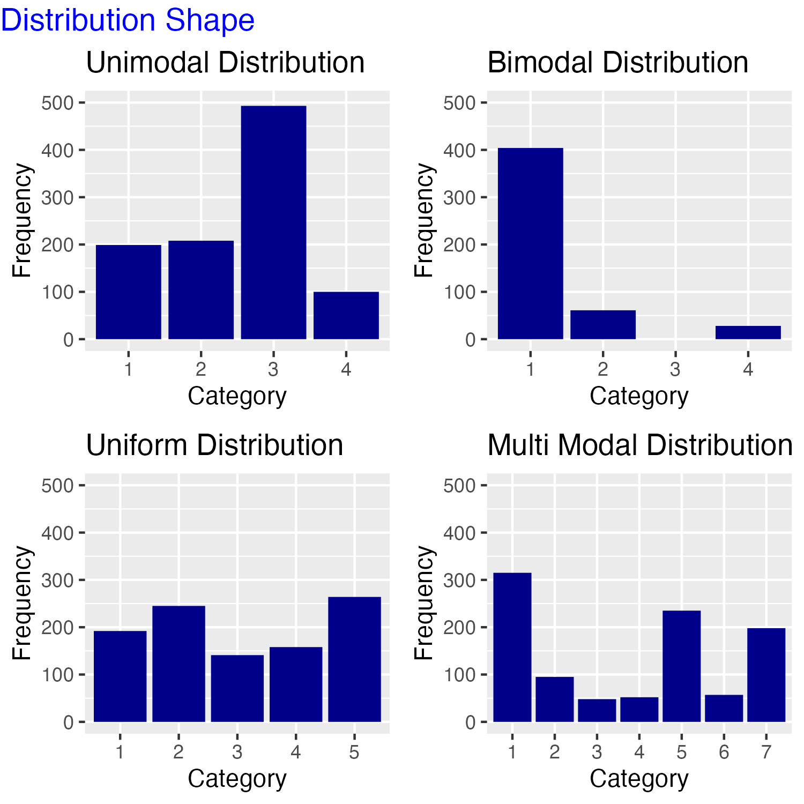

## Learning Objectives

In this tutorial, you will learn how to describe a nominal level variable using summary statistics and plots. Specifically, we will cover:

* How to determine and describe the central tendency of a nominal variable
* How to summarize the dispersion of a nominal variable
* How to combine multiple <span style="color:DarkGreen">dplyr</span> operations with the pipe, `%>%`
  * How to compute counts of observations with `n()`
  * How to summarise groups of observations with `group_by()` and `summarise()` 
  * How to compute proportions using `mutate()`
* How to generate a bar plot of counts and proportions using `ggplot()` and `geom_bar()` from the <span style="color:DarkGreen">ggplot2</span> package

```{r setup, include=FALSE}
library(learnr)
library(tidyverse)
library(knitr)
library(gradethis)
tutorial_options(exercise.checker = gradethis::grade_learnr)
#tutorial_options(exercise.timelimit = 60)
knitr::opts_chunk$set(error = TRUE)
counties <- qpaTutorials::counties
df <- qpaTutorials::df
df$region <- factor(df$region, labels =  c("South", "Northeast", "Midwest", "West"))
library(poliscidata)
```

## Descriptive Statistics

<span style="color:blue">*Descriptive statistics provide simple summaries about the sample and the measures. Together with simple graphical analysis, they form the basis of virtually every quantitative analysis of data.*</span>


The first step in any analysis is to describe the variables that are the focus of our research question in order to convey how they behave, what they look like, and, therefore, what features of the data our explanation needs to account for. For example:


>If we want to understand the causes of mass political polarization in current American politics, our starting point is to describe the nature and extent of polarization. It is important to know just how polarized individual Americans are and whether most Americans are polarized or whether values of political polarization across individuals are highly varied.


>If we want to assess the relationship between the level of democracy in a nation-state and its economic outcomes, we first need to know something about the features of our measures of democracy and of economic outcomes in our data set: how common are democratic governments, are most  democratic or not, and what is the range and typical level of economic prosperity across countries?


>If we want to know why Donald Trump won the 2016 presidential election and our research method relies on county-level analysis of the vote, we want to know how Trump did in the typical county and how much variation there was in his performance across counties. 


Typically our data sets contain observations on a large number of cases where it is difficult, or impossible, to understand the main features of the data by examining all the values a variable takes. Descriptive statistics are used to present quantitative descriptions of our data in a manageable form by reducing the data into simpler summary information. This simplification cannot convey all the nuances in the data, but it provides a picture of the overarching characteristics of the data.

Univariate description involves the examination of a single variable at a time. There are three major characteristics of a single variable that comprise descriptive analysis:

1. <span style="color:blue">**Central tendency**</span>. Central tendency refers to the "typical value" a variable takes.
2. <span style="color:blue">**Dispersion**</span>. Dispersion refers to the spread or variation in the values a variable takes. When assessing dispersion, we want to know how similar or different the values taken by the variable are.
3. <span style="color:blue">**The shape of the distribution**</span>. The distribution of a variable is a summary of the frequency of individual values or ranges of values for a variable.

In most situations, we use statistical summaries as well as visualizations -- plots or figures -- to describe all three of these characteristics for each of the variables in our study.


**How we describe a single variable depends on its level of measurement.** In  this and the next two tutorials, we will introduce descriptive statistics to describe the basic features of nominal, ordinal, and interval level data. In this tutorial, we will cover how to describe nominal level variables. 


Before we get started, see if you can pick out the nominal level measures below.


```{r letter-a, echo=FALSE}
question("Which of the following variables are nominal level measures?",
  answer("The race of a respondent in a survey", correct = TRUE, message="Race is nominal because the possible values of the variable are unranked categories. "),
  answer("The status of the death penalty (permitted or not) in a state", correct = TRUE, message="The status of the death penalty is nominal because permitted or not permitted are categories of responses. "),
  answer("The restrictiveness of a state's gun laws measured with a letter grade", message = "Restrictiveness of gun laws is an ordinal variable. The categories are ordered but the distances between them are not equal"),
  answer("The Polity democracy score measured on a scale from -10 (autocracy) to +10 (democracy)", message = "Polity democracy score is an ordinal variable. The categories are ordered but the distances between them are not equal "),
  allow_retry = TRUE,
  try_again = "Hint: There are two nominal variables in this list."
)
```

## Central Tendency


Central tendency refers to the "typical value" a variable takes. It is the center of the distribution of values a variable can take or the middle. A "distribution" shows all the possible values of a variable and how often each value occurs. The appropriate summary statistic to use to describe the central tendency of a variable depends on its level of measurement. Only one statistic is available to summarize the central tendency of a nominal variable. It is the mode.

### The mode

 <span style="color:blue">**The mode is the most frequently occurring category in the data.**</span>  Specifically, the mode is the *name* of the category that occurs most often. We can determine the mode from a frequency table. A <span style="color:blue">**frequency table lists each value a variable can take and the number of cases in the data that have each value.**</span> Sometimes it is useful to present the proportion of cases in each category, as well as the frequencies. 

### Central tendency and vote for Donald Trump in US counties

To illustrate how to identify the mode and how to produce a frequency table and its cousin a table of proportions, we will examine the variable  **TrumpMajority** in the data frame **counties**. This variable assigns a value of 0 to the county if Clinton won a majority of the vote and 1 if Trump won a majority. 

We will introduce the functions `group_by()`, `summarize()` and `mutate()` from the R package <span style="color:DarkGreen">dplyr</span> in conjunction with **%>%**, called the pipe operator, to produce a frequency table. The pipe operator allows us to perform a sequence of operations to turn the object we start with into another object containing the information we want. Whenever you encounter the pipe operator, you can read the code as saying, "then do this."

### The group_by() function

The `group_by()` function assigns observations in the data frame to separate groups, and it instructs <span style="color:DarkGreen">dplyr</span> to apply functions separately to each group. `group_by()` assigns groups by grouping together observations that have the same combinations of values for the variables that you pass to `group_by()`.

To group by the values of **TrumpMajority** we first tell <span style="color:DarkGreen">dplyr</span> the name of the data frame that contains the variable "and then" using the pipe operator we pass the variable to the `group_by()` function as shown below. Note that we need to load the <span style="color:DarkGreen">dplyr</span> package with the `library()` function.

We will not run this piece of code (it takes a while to produce the result from inside the tutorial).

```{r groupby, exercise=FALSE, eval = FALSE}
library(dplyr)
counties %>%
  group_by(TrumpMajority)
```

While R knows the data is grouped, the output here is the full data frame because we haven't told R what to do with the grouped data.

### The summarise() function

The `summarise()` function collapses a data frame into a single row (if we do not group) or into a single row for each group (if we do group) of summary information. You get to choose which and how many summaries appear in the row and how they are computed. We can summarize the data without grouping, but usually, we will be calculating summary statistics on data we have grouped. In other words, we will produce summary statistics for each category of the grouping variable or variables. We can take the grouped data "and then" (using the pipe operator, %>%) within the `summarise()` function we provide the name(s) of any new summary information and the R expression to generate it (or them).

We wish to calculate a single summary statistic: the frequency or count. The function `n()` (with no arguments) will count the number of cases for each category of the variable we have grouped by.  We want to assign the value of this function to a new variable we will call **freq**, but you can assign any name to the new variable that is permissible in R.

Run the code. (Note: A warning message may appear.)

```{r summarise, exercise=TRUE, warning=FALSE}
counties %>%
  group_by(TrumpMajority) %>%
  summarise(freq=n())
```

What does this frequency table tell us is the modal value of **TrumpMajority**? The most frequently occurring outcome is 1, thus, the mode is one. But "1" is not substantively meaningful. Instead, we say, "The modal county cast a majority of its vote for Donald Trump." (Recall that's the meaning of the value "1" for this variable.) This is useful information because it tells us Donald Trump won more counties than he lost. 

### The mutate() function

While it is easy to see that many more counties cast a majority of their votes for Donald Trump, we also want to know the proportion of counties that did so. Proportions will be particularly important later when we are comparing variables that have different numbers of total cases. To add proportions to our frequency table, we will pipe the result of the `group_by()` and `summarise()` functions to the `mutate()` function. It works similarly to the `summarise()` function. However, the functions passed to `mutate()` append a vector of output to the input data frame, rather than a summary statistic.

The function we wish to calculate is the proportion. To calculate the proportion, we take our new variable **freq** and divide by the total number of counts and assign it to a new variable we will name **prop**: `prop = freq/sum(freq)`.

Let's pipe the result above to the `mutate()` function and create this variable:

```{r mutate, exercise=TRUE, warning=FALSE}
counties %>%
  group_by(TrumpMajority) %>%
  summarize(freq=n()) %>%
  mutate(prop=freq/sum(freq))
```

The addition of the proportions to our table confirms the modal category is "Trump-Majority" and now we can see that nearly 85% of the counties cast a majority of their votes for Donald Trump!  This summary table provides a lot of information about support for Donald Trump across counties in the 2016 presidential election.

### Central tendency and racial majorities in US counties

Let’s look at another nominal variable, **racial_majority**, in the **counties** data frame. The variable takes the (character) values "Black Majority", "Hispanic Majority", "Other Majority", and "White Majority" depending on which racial/ethnic group comprised 50% or more of the county population.  There are two counties where data is not available and are therefore assigned the missing value NA. What can we say about the central tendency of this variable?

We will use the <span style="color:DarkGreen">dplyr</span> functions again to generate a frequency and proportion table. First, we need to group_by **racial_majority**, then we will use `summarise()` to generate the counts, and finally, we will use `mutate()` to create proportions. 

Try it!  Fill in the missing code marked with XXXX. You can look at the hints if you need to.


```{r racetable, exercise = TRUE}
counties %>%
  group_by(XXXX) %>%
  XXXX(freq=n()) %>%
  mutate(prop=XXXX)
```


```{r racetable-hint-1}
1. We want to group by racial_majority, so we pass this variable 
name to the group_by function.
2. The n() function is a summary function, calculating the number 
of cases in each category of the grouping variable, so we need 
to use the summarise() function in the third line of the code.
3. The mutate() function generates a new variable in the data frame 
passed to it.  Here we calculate the proportion using the freq 
variable created in the summarise() function and the sum() 
function in the denominator and name the new variable prop.
```

```{r racetable-solution}
counties %>%
  group_by(racial_majority) %>%
  summarise(freq=n()) %>%
  mutate(prop=freq/sum(freq))
```

```{r racetable-check}
grade_code("This is a lot to remember but is something we will do a lot, so make sure you understand each line of code.")
```

Unsurprisingly, most counties are majority white. "Majority white" is the modal category, with 92% of the counties falling in this category.

### The central tendency of US states across regions

As a final example, consider the variable **region** in the data frame **df**. The variable assigns each US state to a region of the country as defined by the US Census Bureau. The variable takes the character values "South", "Northeast", "Midwest", and "West".

Complete the code below to generate the frequency and proportion distribution of this variable. Name you count variable **freq** and your proportion variable **prop**.


```{r freqregion, exercise=TRUE, exercise.lines=4}
df %>%
  group_by(region) %>%
```

```{r freqregion-hint}
You need to generate frequency counts using the summarise() 
function and proportions using the mutate() function.
Don't forget the pipe operator!
```

```{r freqregion-solution}
df %>%
  group_by(region) %>%
  summarise(freq = n()) %>%
  mutate(prop=freq/sum(freq))
```

```{r freqregion-check}
grade_code()
```


It is important to ask how representative the mode is as a measure of the typical value of the variable. In our first two examples, a single category frequency dominates the distribution of the variable.  But in this case, the modal category has just a few more observations than several of the others so that no category stands out as "more typical" than the rest.  This fact points to the importance of considering the dispersion in the data.


## Dispersion

A frequency or proportion table also describes the dispersion of values the variable takes. In other words, it tells us whether there are similar numbers (proportions) of cases for each value of the variable or different numbers (proportions) across the values. 

**TrumpMajority** contains only two values so we can fully describe the dispersion by stating that 2622 or 84% of the counties cast a majority of their votes for Donald Trump while 490 or 16% cast their votes for Hillary Clinton. 

To describe the dispersion of the **racial_majority** variable, we would report that  2866 (92%) counties were majority white, 102 (3%) were majority black, followed closely by 96 (3%) majority Hispanic.  In 46 (just over 1%) counties the racial majority was something else. Data was unavailable for 2 counties.

Finally, we found that, according to the US Census Bureau, 16 US States are in the South, 13 in the West, 12 in the Midwest, and 9 in the Northeast region.

## The shape of the distribution

The last summary information concerns the shape of the distribution. 
Because the frequency and proportion tables completely characterize the distribution of a nominal variable, we simply need a way to describe its shape.   The relevant question is whether the cases are equally dispersed or whether one or more categories dominates the distribution. We refer to the shape of the distribution of a categorical variable as either:

1. <span style="color:blue">Unimodal</span>: It has only one peak, one category has many more cases than the others
2. <span style="color:blue">Bimodal</span>: It has two peaks, two categories are much more prevalent in the data
3. <span style="color:blue">Uniform</span>: All are distributed uniformly, there is an even spread of observations in each category
4. <span style="color:blue">Multimodal</span>: It has many peaks, several categories have more cases than the others

It is often easier to describe the shape of a distribution from a plot. The figure below presents examples of each of these shapes of distributions.


{ width=50% }


We will learn how to produce plots of the distribution or our nominal variables in the next section.

## Visualizing a nominal variable

The distribution of a nominal variable is best represented in a bar plot. A bar plot presents the same information in a frequency/proportion table in graphical form. 

We will use the `ggplot()` function in the <span style="color:DarkGreen">ggplot2</span> package. The  <span style="color:DarkGreen">ggplot2</span> package develops plots using the "Grammar of Graphics." We will build a plot in 4 steps, with each step identifying a *layer* of our plot.

### ggplot step one

The first step in plotting the data is to tell `ggplot()` the name of the data set that contains the variable(s) to plot. We will plot **TrumpMajority**, which is in the **counties** data set.

Note that we need to load <span style="color:DarkGreen">ggplot2</span>  with the `library()` function before we can use the `ggplot()` function. Run the code below.

```{r stepone, exercise=TRUE}
library(ggplot2)
ggplot(data=counties)
```
We have an empty plot! At this stage, ggplot knows the data to use but not what to plot.

### ggplot step two

Next, we tell `ggplot()` which variable(s) to plot and on which axis. We do this by mapping the variables to the appropriate axis using the `mapping` argument and the `aes()` function. We want to plot the values of **TrumpMajority** on the x-axis. Since the variable is coded as a numeric variable, we need to tell R that it is categorical (that it cannot take values other than 0 and 1). We will do this by passing the variable name to the `factor()` function before assigning it to `x`.

Run the code below.

```{r steptwo, exercise=TRUE}
ggplot(data=counties,  mapping=aes(x=factor(TrumpMajority)))
```
Now we have an x-axis, but still no data because we haven't yet told `ggplot()` *how* to plot the data.  

### ggplot step three

We tell `ggplot()` how to plot the data by adding a *geom* layer. There are many geometric representations that can be plotted. What is appropriate  will depend on the level of measurement and our goals for the visualization.  We want to generate a bar plot, so we will specify `geom_bar()` as the geometric representation. We do this by adding a plus sign at the end of the previous line of code. Then on the next line we write `geom_bar()`. We don't need to put anything inside the parentheses. See what happens now when you run the code.


```{r stepthree, exercise=TRUE}
ggplot(data=counties,  mapping=aes(x=factor(TrumpMajority))) +
  geom_bar()
```
### ggplot step four

At this point, we have an ugly plot that is not very informative. We can change the default labels of the plot by adding another layer to our plot using the `labs()` function. We can pass the function a `title`, `subtitle`, `x` axis title, `y` axis title, and a `caption` argument. To add this information, we need to add a plus sign to the end of the previous code as follows. I've added \\n in the middle of the main title. This tells ggplot to insert a line break in the title and thus to spread it over two lines.

Look carefully at the code before you run it and make sure you understand what each line is doing. Notice that I specified NULL for the `x` axis title. This omits the x-axis label.

```{r stepfour, exercise=TRUE}
ggplot(data=counties,  mapping=aes(x=factor(TrumpMajority))) +
         geom_bar() +
         labs(title = "Number of US Counties that Cast a Majority of \nVotes for the Major Party Presidential Candidates", 
              subtitle = "2016",
              x=NULL,  
              y="Frequency", 
              caption="Source: Linn, Nagler, Zilinsky")
```

We can also change the x-axis value labels. We will want to do this any time the values of the variables are not substantively informative. To do so we add (again with a plus at the end of the last line of the current code) the function `scale_x_discrete()`, passing it labels. Note that this is only a sensible layer to add to a plot if the x-axis measures a discrete variable, i.e., it is categorical. Later we will introduce the `scale_x_continuous()` function.

Look carefully at the last line of code below. To change the labels we have to specify the `label` argument. Because we want to change multiple values, we assign the new labels using the `c()` function. Inside the `c()` function, we first list the old value in parentheses and set it equal to the new value we want for the label, then we repeat for the second label.

```{r stepfourb, exercise=TRUE}
ggplot(data=counties, mapping=aes(x=factor(TrumpMajority))) +
         geom_bar() +
         labs(title = "Number of US Counties that Cast a Majority of \nVotes for the Major Party Presidential Candidates", 
              subtitle = "2016",
              x=NULL,  
              y="Frequency", 
              caption="Source: Linn, Nagler, Zilinsky") +
  scale_x_discrete(labels = c("0" = "Clinton","1" = "Trump"))
```


This plot illustrates the <span style="color:blue">**mode(s)**</span>, <span style="color:blue">**dispersion**</span>, and <span style="color:blue">**shape of the distribution**</span>. 

We can see that Trump won most counties ("Trump Majority" is the mode) and that he won considerably more than did Hillary Clinton (illustrating dispersion) and that the distribution shape is unimodal. The plot presents an effective way to summarize the main features of the variable!

### Dispersion and the distribution of racial majorities in US counties

Can you generate a bar plot of the frequencies of the **racial_majority** distribution?  There is one additional complication with this variable because we do not have data for 2 counties. We can drop these NA cases from the plot by adding `na.translate = FALSE` to the `scale_x_discrete()` function.  I've done this for you in the code below. Before you run the code, replace the XXXX with the appropriate code. Replace the variable values ("Black Majority", "Hispanic Majority", "Other Majority", and "White Majority") with versions without the word "Majority".  Use "Frequency" for the y-axis label. (Note that the ordering of the categories is alphabetical.)


```{r plotrace, exercise = TRUE}
ggplot(data=counties, mapping=XXXX(XXX=factor(racial_majority))) +
  XXXX() +
  labs(title = "Number of US Counties by Racial Majority",
       subtitle = "2016",
       x=NULL,
       y="XXXX",
       caption = "Source: Linn, Nagler, Zilinsky") +
  scale_x_discrete(na.translate = FALSE, labels = c(XXXX))
```

```{r plotrace-hint-1}
1. The mapping argument requires specifying the aesthetics and that you specify the axis to map the variable to.
2. Have you specified the geom? Have you provided a meaningful y label?
3. Have you listed each value taken by racial_majority in quotes and set it
equal to the new label (in quotes)?
```

```{r plotrace-solution}
ggplot(data=counties, mapping=aes(x=factor(racial_majority))) +
  geom_bar() +
  labs(title = "Number of US Counties by Racial Majority",
       subtitle = "2016",
       x=NULL,
       y="Frequency",
       caption = "Source: Linn, Nagler, Zilinsky") +
  scale_x_discrete(na.translate = FALSE, labels = c("Black Majority" = "Black", "Hispanic Majority" = "Hispanic", "Other Majority" = "Other", "White Majority"= "White"))
```

```{r plotrace-check}
grade_code()
```

Here again the plot illustrates the <span style="color:blue">**mode(s)**</span>, <span style="color:blue">**dispersion**</span>, and <span style="color:blue">**shape of the distribution**</span>.  The modal category "Majority White" is vastly more common than any other and the shape of the distribution is clearly unimodal. 


### Plotting proportions

The last thing we will do is plot proportions rather than the frequency distribution.

To plot proportions, we give the `geom_bar()` function  its own aesthetic, which formats the y-axis. This aesthetic takes two arguments: `y=..prop..`, which transforms the y-axis to a proportion, and `group=1`, which tells the function to calculate proportions out of all cases: `geom_bar(aes(y=..prop.., group=1))`.

Let's plot the proportion in each category of the **region** variable in the data frame **df**. In the code below, I'm also going to fill the bars in blue to add a little color. We do this by specifying `fill="blue"` inside `geom_bar()`, but *after* the `aes()` function. The `fill` argument corresponds to the color used to fill the bars. If we wanted to outline the bars in some color, we use the `color` argument. 

```{r propmajority, exercise=TRUE}
ggplot(data=df, mapping=aes(x=factor(region))) +
         geom_bar(aes(y=..prop.., group=1), fill="blue") +
         labs(title = "Proportion of US States in Each Census Region", 
              x=NULL,  
              y="Proportion")
```
What does the plot illustrates about the <span style="color:blue">**mode(s)**</span>, <span style="color:blue">**dispersion**</span>, and <span style="color:blue">**shape of the distribution**</span> of this variable?

While the most frequently occurring category of **region** is "South," it is misleading to emphasize this fact. The number of observations (states)  is in each region is similar. Thus we might describe the shape of the distribution as fairly uniform.


### Dispersion and the distribution of regime type around the world

Let's create a plot of proportions of regime type of countries in the world in 2014, according to *The Economist*, and describe what we see. This variable is called **dem_level4** and is located in the data frame **world**. It takes the values "Full Democ", "Part Democ", "Hybrid", or "Authoritarian". (You might think of these as ranked, but we will treat them as unranked categories.)

Replace the XXXX in the code below. Fill in the bars with the color "red". Be careful to use the y-axis label "Proportion."


```{r plotraceprop, exercise = TRUE, exercise.eval = FALSE}
ggplot(data=XXXX, mapping=aes(x=factor(dem_level4))) +
  geom_bar(XXXX(XXXX=XXXX, XXXX=XXXX),XXXX) +
  labs(title = "Regime Type",
       subtitle = "The Economist",
       x=NULL,
       y="XXXX") +
  XXXX(na.translate = FALSE, labels = c("Full Democ" = "Full Democracy", "Part Democ" = "Partial Democracy", "Hybrid" = "Hybrid", "Authoritarian"= "Authoritarian"))
```


```{r plotraceprop-hint-1}
1. Have you named the data set world?
2. Remember you need to specify the aes() function inside geom_bar().
3. Have you specified y=..prop.. inside the geom_bar aes() function?
4. Have you specified group=1?
5. Have you specified fill="red" outside aes() in geom_bar?
6. Did you set the y label to "Proportion"?
7. Did you specify the scale_x_discrete function to edit the x axis?
```

```{r plotraceprop-solution}
ggplot(data=world, mapping=aes(x=factor(dem_level4))) +
  geom_bar(aes(y=..prop.., group=1), fill="red") +
  labs(title = "Regime Type",
       subtitle = "The Economist",
       x=NULL,
       y="Proportion") +
  scale_x_discrete(na.translate = FALSE, labels = c("Full Democ" = "Full Democracy", "Part Democ" = "Partial Democracy", "Hybrid" = "Hybrid", "Authoritarian"= "Authoritarian"))
```

```{r plotraceprop-check}
grade_code()
```

If we were to write a description of this variable, what would we say about the mode, dispersion, and shape of the distribution?  The plot suggests the data has two modal categories: most countries are either a "Partial Democracy" or "Authoritarian," so we would say this is a bimodal distribution, but the dispersion in the data indicates that countries are spread fairly evenly across the region types. Thus whether we say this is bimodal or fairly uniformly distributed is somewhat subjective.

## A short video on building a bar plot with ggplot2 

This short (less than 4 minute) video builds a bar plot and introduces two additional ways to manipulate the plot: how to reorder the bars and how to flip the plot so that the bars are horizontal. The latter can be useful if the category labels are long.

{width="560" height="315"}

Below I've reproduced our plot of **racial_majority**,  reordering and flipping the coordinates of our previous plot.


```{r fliprace, exercise = TRUE}
ggplot(data=counties, mapping=aes(x=reorder(factor(racial_majority), racial_majority, length))) +
  geom_bar() +
  labs(title = "Number of US Counties by Racial Majority",
       subtitle = "2016",
       x=NULL,
       y="Frequency",
       caption = "Source: Linn, Nagler, Zilinsky") +
  scale_x_discrete(na.translate = FALSE, labels = c("Black Majority" = "Black", "Hispanic Majority" = "Hispanic", "Other Majority" = "Other", "White Majority"= "White")) +
  coord_flip()
```

## The Takeaways

Descriptive statistics provide simple summaries about the sample and the measures. Together with simple graphical analysis, they form the basis of virtually every quantitative analysis of data. We've learned:

1. There are 3 types of descriptive information to help you convey the main features of a single variable: <span style="color:blue">**central tendency**</span>, <span style="color:blue">**dispersion**</span>, and the <span style="color:blue">**shape of the distribution**</span>. Each piece of information complements the others.
2. The appropriate tools for describing these features of our sample data depend on the level of measurement of the variable you wish to describe. The information here describes what is appropriate for nominal variables.

   a. The <span style="color:blue">**mode**</span> is the most commonly occurring category across cases and is the only statistic appropriate for describing the central tendency of a nominal variable. It may be more or less useful depending on the dispersion in the data, so often, we present the entire frequency distribution or visualize the distribution in a bar plot.
    b. The frequency distribution, or the distribution of proportions, reveals the <span style="color:blue">**dispersion**</span> in the data, i.e., it tells us how many or what proportion of cases take each value of the variable.  It also makes clear which category is the modal value and is a numeric representation of the <span style="color:blue">**dispersion**</span>.
   c. Bar plots are often used to visualize the central tendency, dispersion, and shape of the distribution of a nominal variable, particularly if the specific counts or proportions are not of central interest.

Should you present a table, should you report summary statistics in the text without a table or visualization, or should you present a figure when you describe a nominal variable?  The choice depends on the main feature or features of the data and what you wish to emphasize. You may report the modal category or categories and the number or proportion of cases in the category, or you may choose to present the entire distribution, either in a table or a plot. (Both would be redundant.)  The key is to describe the central tendency, dispersion, and distribution of the data so that your audience has a complete picture of the central features of the variable. And of course, if you present a table or figure, you need to describe its contents in the text.


